# Informe de Proyecto Final
## Infraestructura Bancaria Simulada

---

**Universidad Mayor Real y Pontificia de San Francisco Xavier de Chuquisaca**

**Facultad de Ciencias y Tecnología**

**Asignatura:** SIS313 - Infraestructura, Plataformas Tecnológicas y Redes

**Docente:** Ing. Marcelo Quispe Ortega

**Integrantes:**

| Nombre | Rol | Carrera |
|--------|-----|---------|
| Juan Pablo Taboada Camacho | Router/FW + Web DMZ + DNS | Ing. Sistemas |
| Carlos Matias Villarroel Tarraga | DB Core + App Server | Ing. Sistemas |
| Franco Milton Jimenez Amachuy | Cajero + SIEM + Attacker | Ing. Sistemas |

**Subdominio público:** `https://bancoseguro.rootcode.com.bo`

---

## 1. Introducción

El presente proyecto implementa una **Infraestructura Bancaria Simulada** en el Centro de Datos universitario (USFX), usando 8 máquinas virtuales Ubuntu Server 24.04 LTS. Se implementa segmentación de red por zonas, un portal bancario funcional accesible desde internet, hardening de servidores, detección de intrusiones y respuesta a incidentes.

| Tema | Implementación |
|------|----------------|
| T5 Segmentación | iptables/UFW por zonas bancarias |
| T6 Firewall | router-fw + UFW en cada VM |
| T11 Hardening SSH | Puerto 2222, claves ed25519, sin root |
| T12 TLS | Nginx con certificado autofirmado |
| T13 Fail2ban | Detección y bloqueo automático de ataques |
| T14 Auditoría | Script bash con reporte automático |
| T15 Backup cifrado | mysqldump + GPG |

---

## 2. Objetivos

- Implementar segmentación de red: zona cajero, zona DMZ, zona core
- Desplegar portal bancario funcional con autenticación JWT
- Configurar DNS interno BIND9 para `bancoseguro.local`
- Aplicar hardening SSH en todos los servidores
- Implementar TLS/HTTPS en el servidor web
- Configurar logs centralizados con rsyslog
- Simular ataque de fuerza bruta y documentar respuesta
- Generar backups cifrados automáticos

---

## 3. Arquitectura del Sistema

### 3.1 Diagrama General

```
                         INTERNET
                            │
            https://bancoseguro.rootcode.com.bo
                            │
              ┌─────────────▼─────────────┐
              │    PROXY USFX             │
              │    201.131.45.42          │
              └─────────────┬─────────────┘
                            │
              ┌─────────────▼─────────────┐
              │    router-fw (.182)       │
              │    iptables + NAT         │
              │    Fail2ban               │
              └──────┬──────┬──────┬──────┘
                     │      │      │
        ┌────────────▼┐  ┌──▼───┐  ┌▼─────────────┐
        │ dns-server  │  │web-dmz│  │  db-core      │
        │  .183       │  │ .184  │  │  .186         │
        │  BIND9      │  │ Nginx │  │  MariaDB      │
        └─────────────┘  └──┬────┘  └──────┬────────┘
                            │              │
                     ┌──────▼───┐   ┌──────▼────────┐
                     │ cajero   │   │  app-server   │
                     │ .187     │──►│  .185         │
                     └──────────┘   │  Node.js API  │
                                    └───────────────┘
              ┌─────────────┐    ┌─────────────┐
              │ siem-audit  │    │  attacker   │
              │ .188        │    │  .189       │
              └─────────────┘    └─────────────┘
```

### 3.2 Flujo de Tráfico

```
Internet → Proxy USFX → web-dmz:443 (Nginx+TLS) → app-server:3000 → db-core:3306

Cajero → app-server     ✅ PERMITIDO
Cajero → db-core        ❌ BLOQUEADO
web-dmz → db-core       ❌ BLOQUEADO
attacker → web-dmz      ✅ PERMITIDO (simulación)
attacker → db-core      ❌ BLOQUEADO
```

### 3.3 Acceso SSH

```
Proxy USFX → router-fw (puerto 22, contraseña)
router-fw  → todas las demás VMs (puerto 2222, clave ed25519)
```

---

## 4. Tabla de Infraestructura

| VM | Hostname | IP | Servicios |
|----|----------|----|-----------|
| VM-1 | router-fw | 192.168.100.182 | iptables, Fail2ban, NAT |
| VM-2 | dns-server | 192.168.100.183 | BIND9 |
| VM-3 | web-dmz | 192.168.100.184 | Nginx, TLS, Portal |
| VM-4 | app-server | 192.168.100.185 | Node.js, Express, JWT |
| VM-5 | db-core | 192.168.100.186 | MariaDB |
| VM-6 | cajero-terminal | 192.168.100.187 | curl, mariadb-client |
| VM-7 | siem-audit | 192.168.100.188 | rsyslog, Fail2ban |
| VM-8 | attacker | 192.168.100.189 | Hydra, Nmap |

| Parámetro | Valor |
|-----------|-------|
| Subred | 192.168.100.0/24 |
| Gateway datacenter | 192.168.100.1 |
| Gateway proyecto | 192.168.100.182 |
| DNS interno | 192.168.100.183 |
| Dominio interno | bancoseguro.local |
| Dominio público | bancoseguro.rootcode.com.bo |

---

## 5. VM-1: router-fw (192.168.100.182)

El `router-fw` es el corazón de la infraestructura. Actúa como router, firewall y único punto de acceso SSH hacia las demás VMs. Todo el tráfico entre zonas pasa por esta máquina donde se aplican las reglas de segmentación bancaria.

### 5.1 Configuración de Red (Netplan)

Abrimos el archivo de configuración de red de Ubuntu con el editor nano:

```bash
sudo nano /etc/netplan/50-cloud-init.yaml
```

- `sudo` — ejecuta el comando con privilegios de superusuario. Necesario porque el archivo de configuración de red es del sistema y solo root puede modificarlo.
- `nano` — editor de texto en terminal, más sencillo que vim. Permite editar archivos directamente desde la línea de comandos.
- `/etc/netplan/50-cloud-init.yaml` — ruta del archivo de configuración de red. Netplan es el sistema moderno de configuración de red en Ubuntu 24.04 que reemplaza al antiguo `/etc/network/interfaces`. El prefijo `50` indica el orden de carga.

El archivo quedó con el siguiente contenido:

```yaml
network:
  version: 2
  renderer: networkd
  ethernets:
    ens18:
      addresses:
        - "192.168.100.182/24"
      nameservers:
        addresses:
          - 192.168.100.183
          - 8.8.8.8
          - 8.8.4.4
        search: []
      routes:
        - to: "default"
          via: "192.168.100.1"
```
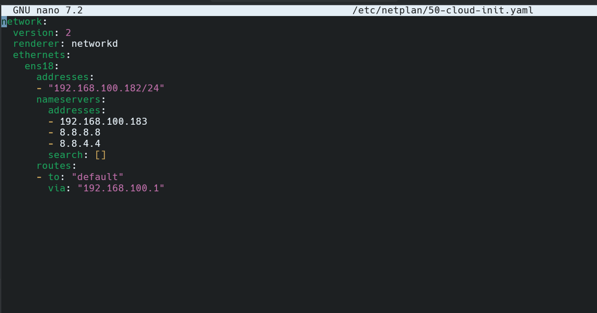
- `version: 2` — versión del formato de Netplan. La versión 2 es la estándar en Ubuntu moderno y soporta todas las funcionalidades necesarias.
- `ethernets` — sección donde se configuran las interfaces de red físicas del servidor.
- `ens18` — nombre de la interfaz de red asignada por el kernel a la tarjeta de red virtual. En VirtualBox/Proxmox suele llamarse `ens18` o `eth0` dependiendo del hardware virtual.
- `addresses: "192.168.100.182/24"` — IP estática con máscara de red /24 que permite 254 hosts (192.168.100.1 a 192.168.100.254). Se usa IP fija para que las demás VMs siempre sepan dónde encontrar al router.
- `nameservers` — servidores DNS que usará esta VM para resolver nombres. Primero el DNS interno del proyecto (.183), luego Google (8.8.8.8) como respaldo si el interno falla.
- `search: []` — lista vacía de dominios de búsqueda. Sin esto, Ubuntu agregaría sufijos automáticamente a los nombres cortos.
- `routes: to: default via: 192.168.100.1` — la ruta por defecto indica por dónde salir cuando el destino no está en la red local. El router-fw sale por el gateway del datacenter (.1) para llegar a internet.

> **Nota importante:** El router-fw es la única VM que apunta directamente al gateway del datacenter (.1). Todas las demás VMs apuntarán al router-fw (.182) como su gateway, obligando todo el tráfico a pasar por las reglas iptables.

Aplicamos la configuración de red:

```bash
sudo netplan apply
```

- `netplan apply` — lee el archivo YAML y aplica la configuración de red inmediatamente sin reiniciar el sistema. Si hay errores de sintaxis (indentación incorrecta en YAML es muy común), mostrará el error y no aplicará los cambios, evitando dejar la red en un estado inconsistente.

### 5.2 Configuración del Hostname

```bash
sudo hostnamectl set-hostname router-fw
```

- `hostnamectl` — herramienta de systemd para gestionar el hostname del sistema.
- `set-hostname router-fw` — cambia el nombre del equipo de forma permanente en `/etc/hostname`. Este nombre aparece en el prompt de la terminal (`adming11@router-fw:~$`), en los logs del sistema y en las comunicaciones SSH.

```bash
exec bash
```

- `exec bash` — reemplaza el proceso actual de bash con uno nuevo, recargando la configuración del shell. Esto hace que el nuevo hostname aparezca inmediatamente en el prompt sin necesidad de cerrar sesión y volver a entrar.

### 5.3 Actualización del Sistema e Instalación de Herramientas

Actualizamos la lista de paquetes disponibles:

```bash
sudo apt update && sudo apt upgrade -y
```

- `apt update` — descarga desde los servidores de Ubuntu la lista actualizada de paquetes disponibles. No instala nada, solo actualiza el índice local para saber qué versiones están disponibles. Es fundamental ejecutarlo antes de instalar cualquier paquete.
- `&&` — operador de encadenamiento condicional. El segundo comando (`apt upgrade`) solo se ejecuta si el primero (`apt update`) terminó sin errores.
- `apt upgrade -y` — instala las actualizaciones de seguridad y correcciones disponibles para todos los paquetes ya instalados. El flag `-y` responde "sí" automáticamente a todas las confirmaciones, evitando interrupciones interactivas.

Instalamos las herramientas necesarias:

```bash
sudo apt install -y iptables iptables-persistent net-tools tcpdump nmap curl wget fail2ban
```

- `apt install` — instala los paquetes listados desde los repositorios de Ubuntu.
- `-y` — confirma automáticamente la instalación sin pedir confirmación del usuario.
- `iptables` — herramienta principal del firewall de Linux. Permite crear reglas que filtran, redirigen o bloquean paquetes de red. Es la base de la segmentación bancaria del proyecto.
- `iptables-persistent` — paquete que instala un servicio systemd que guarda las reglas iptables en archivos (`/etc/iptables/rules.v4`) y las restaura automáticamente cuando el sistema se reinicia. Sin esto, las reglas se pierden al apagar la VM.
- `net-tools` — proporciona herramientas clásicas de red como `ifconfig` (ver interfaces), `netstat` (ver conexiones activas) y `route` (ver tabla de rutas). Útil para diagnóstico.
- `tcpdump` — capturador de paquetes en tiempo real. Permite ver exactamente qué tráfico está pasando por las interfaces del router, útil para verificar que las reglas iptables funcionan correctamente.
- `nmap` — escáner de puertos y descubrimiento de servicios. Se usa para verificar qué puertos están abiertos en las VMs y confirmar que la segmentación funciona.
- `curl` — cliente HTTP de línea de comandos. Se usa para probar los endpoints de la API bancaria y verificar que el portal responde.
- `wget` — herramienta para descargar archivos desde internet. Similar a curl pero orientado a descarga de archivos.
- `fail2ban` — sistema de prevención de intrusiones. Analiza los logs del sistema en busca de patrones de ataque (como múltiples intentos fallidos de SSH) y bloquea automáticamente las IPs atacantes usando iptables.

### 5.4 Habilitación de IP Forwarding

El IP Forwarding es el mecanismo que convierte a Linux en un router real. Por defecto, cuando una VM Linux recibe un paquete destinado a otra IP, lo descarta. Con IP Forwarding activado, lo reenvía actuando como intermediario entre redes.

```bash
sudo nano /etc/sysctl.conf
```
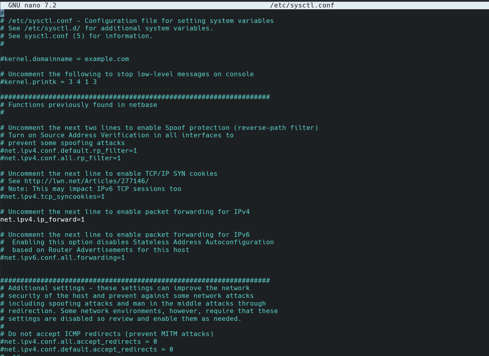

- `/etc/sysctl.conf` — archivo de configuración de parámetros del kernel de Linux. Permite ajustar comportamientos del sistema operativo en tiempo de ejecución.

Buscamos y descomentamos la línea:

```
# Antes (comentado, inactivo):
#net.ipv4.ip_forward=1

# Después (descomentado, activo):
net.ipv4.ip_forward=1
```

- `net.ipv4.ip_forward=1` — parámetro del kernel que habilita el reenvío de paquetes IPv4 entre interfaces de red. El valor `1` activa la función, `0` la desactiva.

Aplicamos el cambio sin reiniciar:

```bash
sudo sysctl -p
```

- `sysctl` — herramienta para leer y modificar parámetros del kernel en tiempo de ejecución.
- `-p` — carga los parámetros desde el archivo `/etc/sysctl.conf` y los aplica inmediatamente. Sin esta opción, el cambio solo surtiría efecto al reiniciar.

Verificamos que quedó activo:

```bash
cat /proc/sys/net/ipv4/ip_forward
```
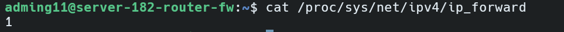
- `cat` — muestra el contenido de un archivo en la terminal.
- `/proc/sys/net/ipv4/ip_forward` — archivo virtual del kernel (en el sistema de archivos `/proc`) que refleja el estado actual del IP forwarding. Devuelve `1` si está activo, `0` si no.

### 5.5 Reglas iptables Base

Limpiamos cualquier regla preexistente para empezar desde cero:

```bash
sudo iptables -F
```

- `iptables` — herramienta de firewall de Linux.
- `-F` — Flush (vaciar). Elimina todas las reglas de la tabla `filter` (tabla por defecto que contiene las cadenas INPUT, OUTPUT y FORWARD). Es necesario limpiar antes de agregar reglas nuevas para evitar conflictos.

```bash
sudo iptables -t nat -F
```

- `-t nat` — especifica que estamos trabajando con la tabla `nat` en lugar de la tabla `filter` por defecto. La tabla nat maneja la traducción de direcciones (NAT/MASQUERADE).
- `-F` — vacía todas las reglas de la tabla nat.

```bash
sudo iptables -X
```

- `-X` — elimina todas las cadenas personalizadas (las que no son las predefinidas INPUT, OUTPUT, FORWARD). Limpia cadenas que pudieran haber quedado de configuraciones anteriores.

Definimos las políticas por defecto:

```bash
sudo iptables -P INPUT ACCEPT
```

- `-P INPUT ACCEPT` — establece la política por defecto de la cadena INPUT en ACCEPT. La cadena INPUT controla el tráfico destinado al propio router-fw. ACCEPT significa que si ninguna regla específica coincide, el paquete es aceptado. El router necesita recibir conexiones SSH del proxy del docente.

```bash
sudo iptables -P FORWARD DROP
```

- `-P FORWARD DROP` — establece la política por defecto de la cadena FORWARD en DROP. La cadena FORWARD controla el tráfico que pasa a través del router de una red a otra. DROP significa que si ninguna regla específica permite el tráfico, se descarta silenciosamente. Este es el principio de "mínimo privilegio": nada pasa a menos que esté explícitamente autorizado.

```bash
sudo iptables -P OUTPUT ACCEPT
```

- `-P OUTPUT ACCEPT` — el tráfico generado por el propio router puede salir libremente. El router necesita poder iniciar conexiones (para actualizaciones, SSH a otras VMs, etc.).

Permitimos el tráfico local (loopback):

```bash
sudo iptables -A INPUT -i lo -j ACCEPT
```

- `-A INPUT` — agrega (Append) una regla al final de la cadena INPUT.
- `-i lo` — coincide con paquetes que entran por la interfaz loopback (`lo`, dirección 127.0.0.1). Los servicios locales del router se comunican entre sí por loopback.
- `-j ACCEPT` — la acción (Jump) a ejecutar cuando la regla coincide: aceptar el paquete.

Permitimos el tráfico de retorno de conexiones ya establecidas:

```bash
sudo iptables -A FORWARD -m state --state ESTABLISHED,RELATED -j ACCEPT
sudo iptables -A INPUT -m state --state ESTABLISHED,RELATED -j ACCEPT
```

- `-m state` — carga el módulo de seguimiento de estado de conexiones. iptables puede rastrear el estado de cada conexión TCP/UDP.
- `--state ESTABLISHED,RELATED` — coincide con paquetes que pertenecen a una conexión ya establecida (ESTABLISHED) o relacionada con una existente (RELATED, como las respuestas ICMP de error). Sin esta regla, si el cajero hace una consulta permitida a app-server, la respuesta de app-server sería bloqueada por la política DROP.

Configuramos NAT para que las VMs internas puedan salir a internet:

```bash
sudo iptables -t nat -A POSTROUTING -o ens18 -j MASQUERADE
```

- `-t nat` — trabajamos con la tabla nat.
- `-A POSTROUTING` — agrega una regla a la cadena POSTROUTING, que procesa paquetes justo antes de que salgan por una interfaz.
- `-o ens18` — coincide con paquetes que salen por la interfaz `ens18` (la interfaz hacia internet).
- `-j MASQUERADE` — técnica de NAT que reemplaza la IP origen del paquete con la IP del router-fw. Así cuando `db-core` hace `apt update`, el router "presta" su IP pública para salir a internet. Los paquetes de retorno llegan al router y este los reenvía a la VM correcta.

Permitimos que las VMs internas salgan a internet:

```bash
sudo iptables -A FORWARD -s 192.168.100.0/24 -o ens18 -j ACCEPT
```

- `-s 192.168.100.0/24` — coincide con paquetes cuyo origen es cualquier IP en la subred 192.168.100.x/24 (todas nuestras VMs).
- `-o ens18` — paquetes que van a salir por la interfaz `ens18` (hacia internet).
- `-j ACCEPT` — permitir el reenvío. Combinado con MASQUERADE, las VMs pueden hacer `apt update`, descargar paquetes, etc.

Guardamos las reglas permanentemente:

```bash
sudo netfilter-persistent save
```

- `netfilter-persistent` — servicio instalado con el paquete `iptables-persistent` que gestiona la persistencia de reglas iptables.
- `save` — guarda todas las reglas actuales de iptables en `/etc/iptables/rules.v4` (IPv4) y `/etc/iptables/rules.v6` (IPv6). Al arrancar el sistema, el servicio `netfilter-persistent` carga automáticamente estas reglas, asegurando que la configuración de seguridad sobreviva reinicios.

### 5.6 Configuración de Fail2ban

```bash
sudo nano /etc/fail2ban/jail.local
```

- `jail.local` — archivo de configuración local de Fail2ban. El sufijo `.local` indica que sobreescribe la configuración por defecto en `jail.conf` sin modificarla. Es la práctica recomendada para que las actualizaciones de Fail2ban no sobreescriban nuestra configuración.

Contenido completo del archivo:

```ini
[DEFAULT]
bantime  = 600
findtime = 300
maxretry = 3
backend  = systemd

[sshd]
enabled  = true
port     = 22
logpath  = /var/log/auth.log
maxretry = 3
bantime  = 600
```
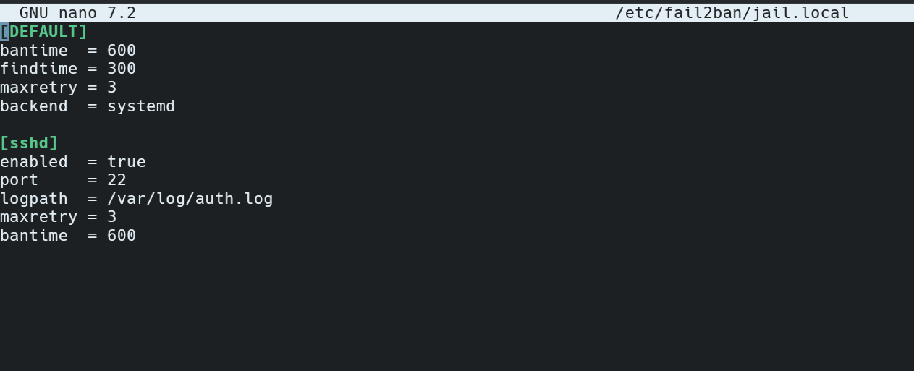

- `[DEFAULT]` — sección con valores por defecto aplicados a todos los jails.
- `bantime = 600` — tiempo de baneo en segundos. 600 segundos = 10 minutos. La IP atacante no puede conectarse durante este período.
- `findtime = 300` — ventana de tiempo en segundos dentro de la cual se cuentan los intentos fallidos. 300 segundos = 5 minutos.
- `maxretry = 3` — número máximo de intentos fallidos permitidos dentro del `findtime`. Si una IP falla 3 veces en 5 minutos, es baneada por 10 minutos.
- `backend = systemd` — fuente de donde Fail2ban lee los logs. `systemd` indica que usa el journal de systemd (journald) en lugar de archivos de log tradicionales.
- `[sshd]` — sección de configuración específica para proteger el servicio SSH.
- `enabled = true` — activa este jail (celda de monitoreo).
- `port = 22` — puerto SSH a monitorear y bloquear.
- `logpath = /var/log/auth.log` — archivo de logs de autenticación donde aparecen los intentos fallidos de SSH.

```bash
sudo systemctl enable fail2ban
```

- `systemctl enable fail2ban` — registra Fail2ban para iniciarse automáticamente cada vez que el sistema arranque. Crea un enlace simbólico en los directorios de systemd para que el servicio se active en el nivel de ejecución normal.

```bash
sudo systemctl start fail2ban
```

- `systemctl start fail2ban` — inicia el servicio Fail2ban inmediatamente sin esperar a un reinicio.

```bash
sudo fail2ban-client status sshd
```
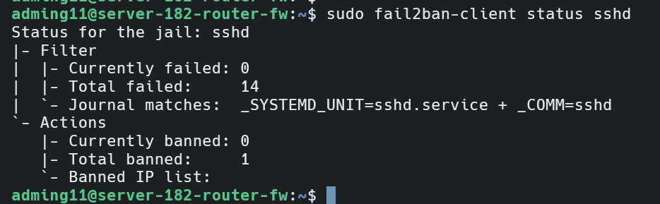
- `fail2ban-client` — herramienta de línea de comandos para interactuar con el servidor Fail2ban en ejecución.
- `status sshd` — muestra el estado del jail `sshd`: cuántos intentos fallidos se han detectado, cuántas IPs están baneadas actualmente y el total histórico de baneos.

### 5.7 Configuración rsyslog para enviar logs al SIEM

```bash
sudo nano /etc/rsyslog.d/50-remote.conf
```
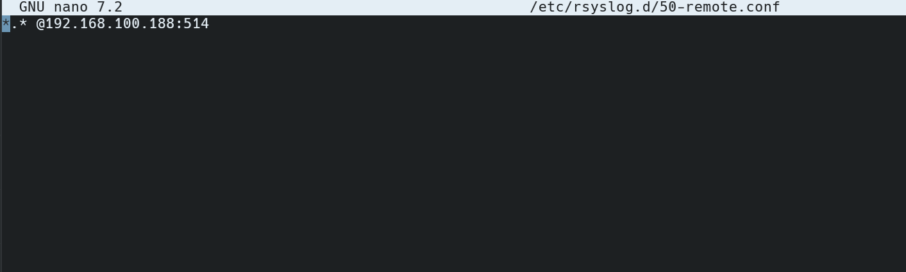
- `/etc/rsyslog.d/` — directorio donde se colocan archivos de configuración adicionales de rsyslog. Se cargan en orden alfabético/numérico, por eso el prefijo `50`.
- `50-remote.conf` — nombre del archivo de configuración para el envío remoto de logs.

Contenido completo del archivo:

```
*.* @192.168.100.188:514
```

- `*.*` — comodín que significa "todas las facilidades y todas las severidades". En syslog, las facilidades son categorías de servicios (kern, auth, daemon, etc.) y las severidades son niveles de urgencia (emergency, alert, crit, error, warning, notice, info, debug). El `*.*` captura absolutamente todos los logs del sistema.
- `@` — indica que el destino es un servidor remoto usando el protocolo UDP. Si fuera `@@` sería TCP (más confiable pero más lento).
- `192.168.100.188:514` — IP del servidor siem-audit y puerto 514, que es el puerto estándar del protocolo syslog según el RFC 3164.

```bash
sudo systemctl restart rsyslog
```

- `systemctl restart rsyslog` — detiene y vuelve a iniciar el servicio rsyslog para que cargue la nueva configuración del archivo que acabamos de crear. Un simple `reload` no siempre es suficiente cuando se agregan nuevos módulos.

### 5.8 Configuración DNS en systemd-resolved

Ubuntu 24.04 usa `systemd-resolved` como resolver DNS. Para que use nuestro DNS interno necesitamos configurarlo específicamente.

```bash
sudo mkdir -p /etc/systemd/resolved.conf.d
```

- `mkdir` — crea un directorio.
- `-p` — crea el directorio y todos los directorios padre necesarios. Si el directorio ya existe, no da error (sin `-p` daría error si ya existe).
- `/etc/systemd/resolved.conf.d` — directorio donde se colocan archivos de configuración adicionales de systemd-resolved. Al igual que rsyslog, los archivos en este directorio sobreescriben la configuración principal sin modificarla.

```bash
sudo nano /etc/systemd/resolved.conf.d/bancoseguro.conf
```

Contenido completo del archivo:

```ini
[Resolve]
DNS=192.168.100.183
Domains=~bancoseguro.local
```
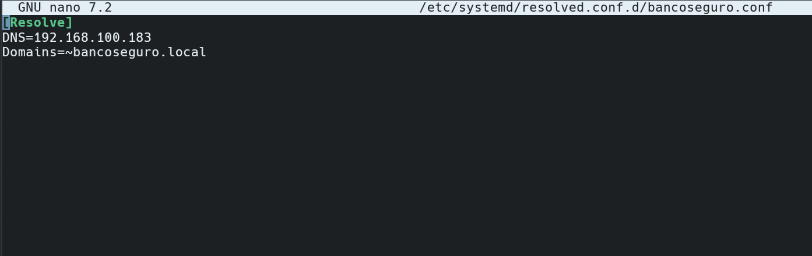

- `[Resolve]` — sección de configuración del resolver DNS.
- `DNS=192.168.100.183` — servidor DNS a usar: nuestro dns-server con BIND9.
- `Domains=~bancoseguro.local` — el símbolo `~` al inicio indica que este DNS se usa como "routing domain" para el dominio especificado. Significa: "para todas las consultas de `*.bancoseguro.local`, usa el servidor `192.168.100.183`". Las consultas de otros dominios (google.com, etc.) siguen usando el DNS normal de internet.

```bash
sudo systemctl restart systemd-resolved
```

- `systemctl restart systemd-resolved` — reinicia el servicio resolver DNS para aplicar la nueva configuración. Después de esto, comandos como `dig web-dmz.bancoseguro.local` funcionarán correctamente.

---

## 6. VM-2: dns-server (192.168.100.183)

El `dns-server` implementa un servidor DNS interno con BIND9 que resuelve el dominio `bancoseguro.local`, permitiendo que las VMs se comuniquen usando nombres legibles en lugar de IPs.

### 6.1 Configuración de Red (Netplan)

```bash
sudo nano /etc/netplan/50-cloud-init.yaml
```

Contenido completo del archivo:

```yaml
network:
  version: 2
  renderer: networkd
  ethernets:
    ens18:
      addresses:
        - "192.168.100.183/24"
      nameservers:
        addresses:
          - 192.168.100.183
          - 8.8.8.8
          - 8.8.4.4
        search: []
      routes:
        - to: "default"
          via: "192.168.100.182"
```

- `renderer: networkd` — indica que se usará `systemd-networkd` como backend para aplicar la configuración. Es el recomendado para servidores Ubuntu sin interfaz gráfica y aplica correctamente los DNS definidos en Netplan.
- `via: 192.168.100.182` — el gateway de esta VM es el router-fw, obligando al tráfico entre VMs a pasar por las reglas iptables de segmentación.

```bash
sudo netplan apply
```

### 6.2 Hostname e Instalación de BIND9

```bash
sudo hostnamectl set-hostname dns-server
exec bash
```

```bash
sudo apt update && sudo apt upgrade -y
sudo apt install -y bind9 bind9utils bind9-doc ufw curl
```

- `bind9` — el servidor DNS principal (Berkeley Internet Name Domain versión 9). Es el software de DNS más utilizado en el mundo, capaz de funcionar como servidor autoritativo (tiene la base de datos oficial de una zona) y como resolver recursivo (busca respuestas en otros servidores DNS).
- `bind9utils` — herramientas de diagnóstico y verificación para BIND9. Incluye `named-checkconf` (verifica la sintaxis de configuración) y `named-checkzone` (verifica la integridad de archivos de zona).
- `bind9-doc` — documentación del paquete BIND9.

### 6.3 Configuración de Opciones Globales BIND9

```bash
sudo nano /etc/bind/named.conf.options
```
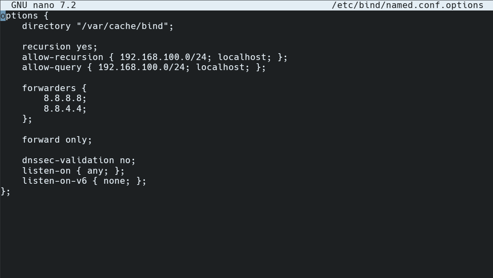
- `/etc/bind/` — directorio principal de configuración de BIND9.
- `named.conf.options` — archivo de opciones globales del servidor DNS. Define cómo se comporta el servidor en general.

Contenido completo del archivo:

```
options {
    directory "/var/cache/bind";
    recursion yes;
    allow-recursion { 192.168.100.0/24; localhost; };
    allow-query { 192.168.100.0/24; localhost; };
    forwarders {
        8.8.8.8;
        8.8.4.4;
    };
    forward only;
    dnssec-validation no;
    listen-on { any; };
    listen-on-v6 { none; };
};
```

- `directory "/var/cache/bind"` — directorio de trabajo donde BIND9 guarda archivos temporales, caché de consultas y archivos de estado. BIND9 necesita acceso de escritura a este directorio.
- `recursion yes` — habilita la resolución recursiva. Cuando BIND9 recibe una consulta que no sabe responder directamente, va a buscar la respuesta en otros servidores DNS (raíces, TLDs, etc.) o la reenvía a los forwarders.
- `allow-recursion { 192.168.100.0/24; localhost; }` — restricción de seguridad: solo las IPs de nuestra red interna (192.168.100.x) y el propio servidor (localhost) pueden hacer consultas recursivas. Esto evita que el servidor sea usado como "open resolver" por atacantes externos para ataques de amplificación DNS.
- `allow-query { 192.168.100.0/24; localhost; }` — solo nuestra red puede consultar este servidor DNS. Cualquier consulta desde una IP externa es rechazada.
- `forwarders { 8.8.8.8; 8.8.4.4; }` — cuando BIND9 recibe una consulta de un nombre que no está en ninguna zona local (como `google.com`), la reenvía a estos servidores DNS de Google en lugar de intentar resolverla desde las raíces. Esto es más rápido y eficiente.
- `forward only` — fuerza a BIND9 a usar exclusivamente los forwarders para nombres externos en lugar de intentar resolución recursiva completa. Necesario porque la red del datacenter tiene problemas con IPv6 y la resolución completa fallaba.
- `dnssec-validation no` — desactiva la validación DNSSEC (DNS Security Extensions). DNSSEC usa criptografía para verificar la autenticidad de respuestas DNS. Lo desactivamos porque la red del datacenter no tiene IPv6 disponible y los intentos de validación DNSSEC generaban errores y timeouts.
- `listen-on { any; }` — BIND9 escucha consultas DNS entrantes en todas las interfaces de red IPv4 disponibles.
- `listen-on-v6 { none; }` — no escucha en interfaces IPv6. La red del datacenter no tiene IPv6 disponible, y si BIND9 intentara usarlo generaría errores constantes de `network unreachable`.

### 6.4 Deshabilitar IPv6 en BIND9

```bash
sudo nano /etc/default/named
```
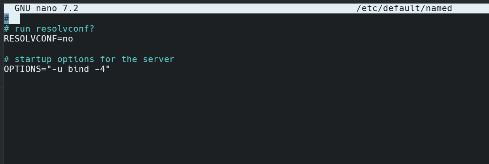
- `/etc/default/named` — archivo de variables de entorno del servicio `named` (el proceso principal de BIND9). Define opciones que se pasan al ejecutable al iniciar.

Contenido completo del archivo:

```
OPTIONS="-u bind -4"
```

- `OPTIONS` — variable que contiene las opciones de línea de comandos pasadas a BIND9 al iniciar.
- `-u bind` — ejecuta BIND9 con el usuario `bind` (no como root), por seguridad.
- `-4` — fuerza a BIND9 a usar exclusivamente IPv4 para todas las comunicaciones. Sin esta opción, BIND9 intenta usar IPv6 para contactar servidores raíz y forwarders, lo que genera errores `network unreachable` porque la red del datacenter no tiene IPv6.

### 6.5 Configuración de Zonas

```bash
sudo nano /etc/bind/named.conf.local
```
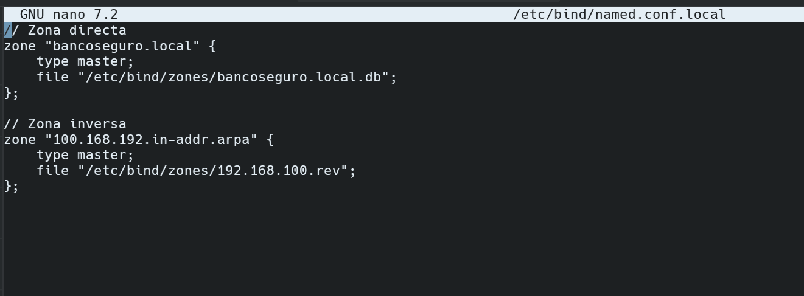
- `named.conf.local` — archivo donde se definen las zonas DNS locales (propias del servidor). Es el lugar correcto para agregar zonas personalizadas sin modificar los archivos de configuración predeterminados.

Contenido completo del archivo:

```
// Zona directa: nombre → IP
zone "bancoseguro.local" {
    type master;
    file "/etc/bind/zones/bancoseguro.local.db";
};

// Zona inversa: IP → nombre
zone "100.168.192.in-addr.arpa" {
    type master;
    file "/etc/bind/zones/192.168.100.rev";
};
```

- `zone "bancoseguro.local"` — declara la zona DNS para el dominio `bancoseguro.local`. Todo lo que termine en `.bancoseguro.local` será resuelto por este servidor.
- `type master` — este servidor es el servidor autoritativo principal (master/primary) de la zona. Tiene la copia original y definitiva de los registros DNS.
- `file` — ruta al archivo de base de datos de la zona donde están definidos los registros DNS.
- `zone "100.168.192.in-addr.arpa"` — zona de DNS inverso. El formato especial `100.168.192.in-addr.arpa` es la convención para las búsquedas inversas de la red 192.168.100.x, escrita al revés. Permite resolver IPs a nombres (en lugar de nombres a IPs).

```bash
sudo mkdir -p /etc/bind/zones
```

- `mkdir -p /etc/bind/zones` — crea el directorio `zones` dentro de `/etc/bind/` para organizar los archivos de zona. BIND9 no crea este directorio automáticamente y fallará si no existe cuando intente cargar las zonas.

### 6.6 Archivo de Zona Directa (nombre → IP)

```bash
sudo nano /etc/bind/zones/bancoseguro.local.db
```
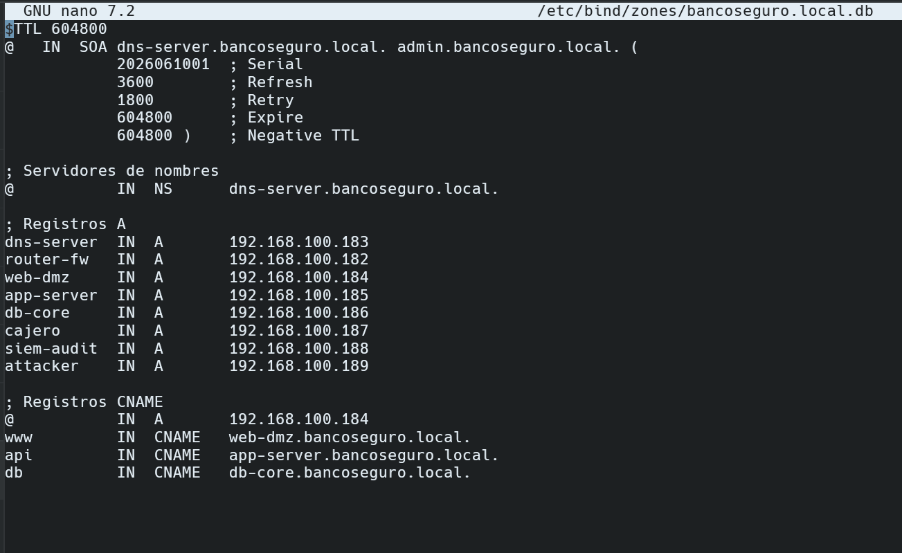
Contenido completo del archivo:

```
$TTL 604800
@   IN  SOA dns-server.bancoseguro.local. admin.bancoseguro.local. (
            2026061001  ; Serial
            3600        ; Refresh
            1800        ; Retry
            604800      ; Expire
            604800 )    ; Negative TTL

; Servidores de nombres
@           IN  NS      dns-server.bancoseguro.local.

; Registros A (nombre → IP)
dns-server  IN  A       192.168.100.183
router-fw   IN  A       192.168.100.182
web-dmz     IN  A       192.168.100.184
app-server  IN  A       192.168.100.185
db-core     IN  A       192.168.100.186
cajero      IN  A       192.168.100.187
siem-audit  IN  A       192.168.100.188
attacker    IN  A       192.168.100.189

; Registros CNAME (alias)
@           IN  A       192.168.100.184
www         IN  CNAME   web-dmz.bancoseguro.local.
api         IN  CNAME   app-server.bancoseguro.local.
db          IN  CNAME   db-core.bancoseguro.local.
```

- `$TTL 604800` — Time To Live por defecto en segundos (604800 = 7 días). Indica cuánto tiempo los clientes DNS deben mantener en caché las respuestas antes de volver a preguntar.
- `@` — símbolo especial que representa el origen de la zona, en este caso `bancoseguro.local.`
- `IN` — clase de registro Internet, la única que se usa en la práctica.
- `SOA` — Start of Authority. Registro obligatorio que define el servidor autoritativo de la zona, el email del administrador (con `.` en lugar de `@`) y parámetros de sincronización.
- `Serial 2026061001` — número de versión de la zona en formato YYYYMMDDNN. Cada vez que se modifica la zona se debe incrementar este número para que los servidores secundarios detecten el cambio.
- `Refresh 3600` — cada cuántos segundos los servidores secundarios verifican si hay cambios en el master (1 hora).
- `Retry 1800` — si falla el refresh, cuántos segundos esperar antes de reintentar (30 minutos).
- `Expire 604800` — si el secundario no puede contactar al master, cuánto tiempo considera válidos sus datos antes de dejar de responder (7 días).
- `Negative TTL 604800` — cuánto tiempo cachear respuestas negativas (dominio no existe).
- `NS` — Name Server record. Indica qué servidor DNS es autoritativo para esta zona.
- `A` — Address record. Mapea un nombre de host a una dirección IPv4. Es el tipo de registro más fundamental en DNS.
- `CNAME` — Canonical Name record. Alias que apunta a otro nombre en lugar de directamente a una IP. Útil para que `www.bancoseguro.local` y `web-dmz.bancoseguro.local` resuelvan a la misma IP sin duplicar el registro A.

### 6.7 Archivo de Zona Inversa (IP → nombre)

```bash
sudo nano /etc/bind/zones/192.168.100.rev
```
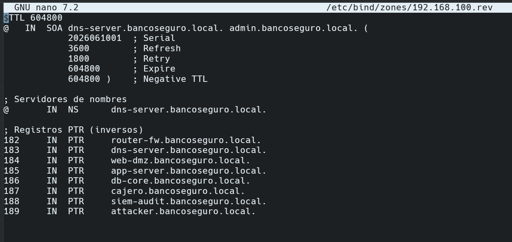
Contenido completo del archivo:

```
$TTL 604800
@   IN  SOA dns-server.bancoseguro.local. admin.bancoseguro.local. (
            2026061001  ; Serial
            3600        ; Refresh
            1800        ; Retry
            604800      ; Expire
            604800 )    ; Negative TTL

@       IN  NS      dns-server.bancoseguro.local.

; Registros PTR (IP → nombre)
182     IN  PTR     router-fw.bancoseguro.local.
183     IN  PTR     dns-server.bancoseguro.local.
184     IN  PTR     web-dmz.bancoseguro.local.
185     IN  PTR     app-server.bancoseguro.local.
186     IN  PTR     db-core.bancoseguro.local.
187     IN  PTR     cajero.bancoseguro.local.
188     IN  PTR     siem-audit.bancoseguro.local.
189     IN  PTR     attacker.bancoseguro.local.
```

- `PTR` — Pointer record. Registro de DNS inverso que mapea el último octeto de una IP al nombre del host. Por ejemplo, `182` en la zona `100.168.192.in-addr.arpa` corresponde a `192.168.100.182`. Cuando se hace `dig -x 192.168.100.184`, el DNS busca el registro PTR para `184.100.168.192.in-addr.arpa` y devuelve `web-dmz.bancoseguro.local.`
- Los registros PTR son importantes para que los logs del sistema muestren nombres legibles en lugar de IPs, facilitando el análisis de incidentes de seguridad.

### 6.8 Verificación de Sintaxis

```bash
sudo named-checkconf
```

- `named-checkconf` — verifica la sintaxis de todos los archivos de configuración de BIND9 (named.conf, named.conf.options, named.conf.local). Si no muestra ninguna salida, significa que no hay errores. Si hay errores, los muestra con el número de línea y descripción.

```bash
sudo named-checkzone bancoseguro.local /etc/bind/zones/bancoseguro.local.db
```

- `named-checkzone` — verifica la integridad y sintaxis del archivo de zona especificado. Detecta registros duplicados, referencias a nombres que no existen, errores de formato, etc.
- `bancoseguro.local` — nombre de la zona a verificar.
- `/etc/bind/zones/bancoseguro.local.db` — ruta del archivo de zona a verificar.
- Si todo está correcto muestra: `zone bancoseguro.local/IN: loaded serial 2026061001` y luego `OK`.

```bash
sudo named-checkzone 100.168.192.in-addr.arpa /etc/bind/zones/192.168.100.rev
```

- Misma verificación pero para la zona inversa.

### 6.9 Inicio del Servicio BIND9

```bash
sudo systemctl enable named
```

- `systemctl enable named` — en Ubuntu 24.04, el servicio de BIND9 se llama `named` (no `bind9`). Este comando lo registra para inicio automático al arrancar el sistema.

```bash
sudo systemctl start named
```

- `systemctl start named` — inicia el servicio BIND9 inmediatamente.

```bash
sudo systemctl status named
```
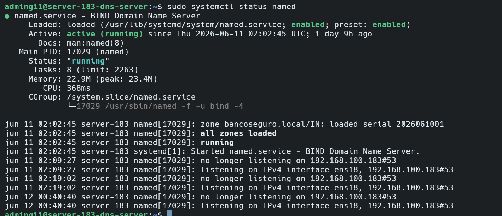
- `systemctl status named` — muestra el estado del servicio: si está activo/inactivo, cuándo inició, el PID del proceso y las últimas líneas del log. Permite verificar rápidamente si el servicio arrancó sin errores.

### 6.10 Pruebas de Resolución DNS

```bash
dig @192.168.100.183 web-dmz.bancoseguro.local
```
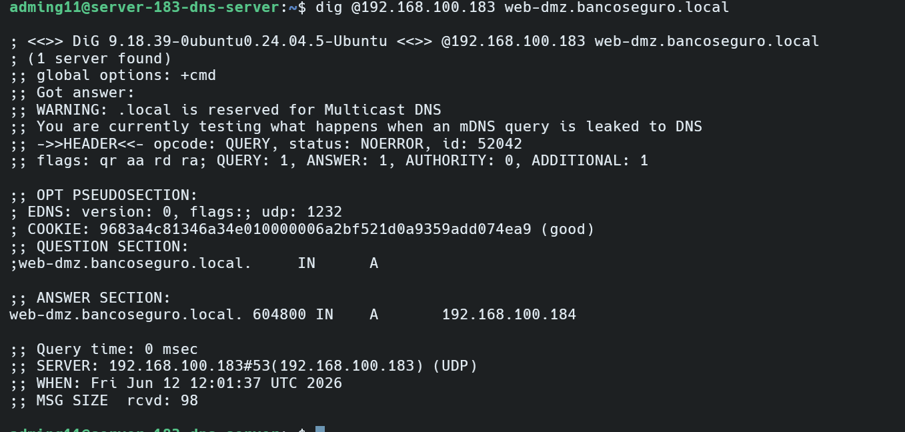
- `dig` — herramienta de diagnóstico DNS (Domain Information Groper). Hace consultas DNS y muestra la respuesta completa incluyendo todos los campos del protocolo.
- `@192.168.100.183` — especifica explícitamente qué servidor DNS consultar (nuestro dns-server). Sin esta opción, `dig` usaría el DNS configurado en el sistema.
- `web-dmz.bancoseguro.local` — nombre a resolver. El resultado debe mostrar `status: NOERROR` y en `ANSWER SECTION` debe aparecer `192.168.100.184`.

```bash
dig @192.168.100.183 google.com
```
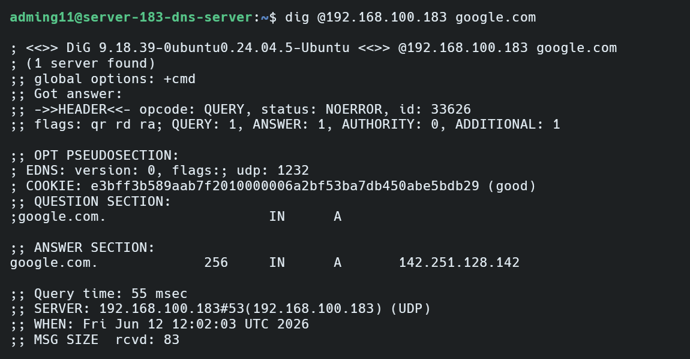

- Verifica que los forwarders (8.8.8.8) funcionan correctamente. Si responde con la IP de Google, el DNS puede resolver nombres de internet también.

### 6.11 Configuración DNS en systemd-resolved

```bash
sudo mkdir -p /etc/systemd/resolved.conf.d
sudo nano /etc/systemd/resolved.conf.d/bancoseguro.conf
```
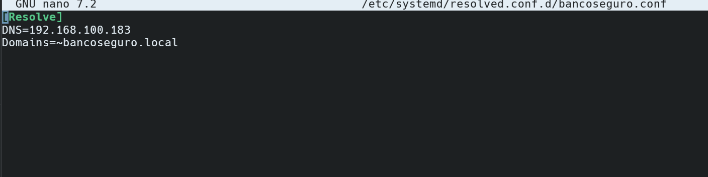
```ini
[Resolve]
DNS=192.168.100.183
Domains=~bancoseguro.local
```

```bash
sudo systemctl restart systemd-resolved
```

### 6.12 Configuración UFW

```bash
sudo ufw default deny incoming
```

- `ufw default deny incoming` — establece la política por defecto de UFW para tráfico entrante en DENY (denegar). Todo paquete que llegue a esta VM será rechazado a menos que haya una regla explícita que lo permita.

```bash
sudo ufw default allow outgoing
```

- `ufw default allow outgoing` — permite todo el tráfico saliente. La VM puede iniciar conexiones sin restricciones.

```bash
sudo ufw allow 22/tcp
```

- `ufw allow 22/tcp` — crea una regla que permite el tráfico TCP entrante en el puerto 22 (SSH). Necesario para poder administrar la VM.

```bash
sudo ufw allow 53/tcp
sudo ufw allow 53/udp
```

- `ufw allow 53/tcp` — permite consultas DNS sobre TCP. Las consultas DNS normalmente usan UDP, pero TCP se usa para respuestas grandes (>512 bytes) y para transferencias de zona entre servidores DNS.
- `ufw allow 53/udp` — permite consultas DNS sobre UDP, el protocolo más común para DNS. Sin esta regla, ninguna VM de la red podría consultar nuestro servidor DNS.

```bash
sudo ufw enable
```

- `ufw enable` — activa el firewall UFW. A partir de este momento, solo se permite el tráfico definido por las reglas. Sin ejecutar este comando, las reglas existen pero no se aplican.
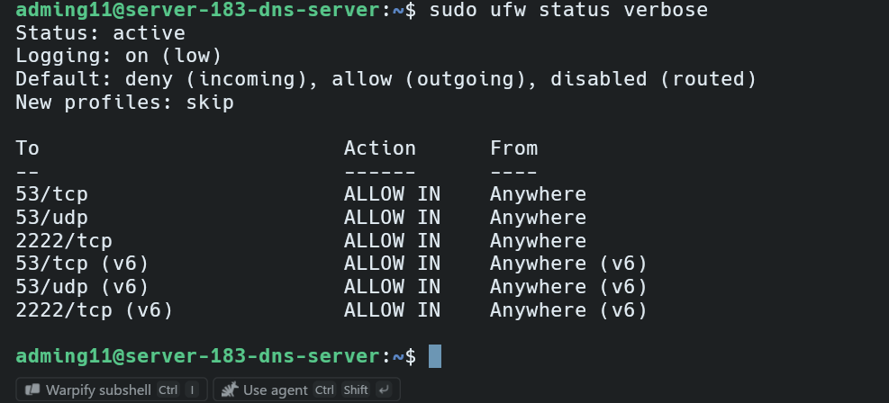
---

## 7. VM-3: web-dmz (192.168.100.184)

El `web-dmz` es el servidor web público en la zona DMZ (zona desmilitarizada). Sirve el portal bancario con Nginx sobre HTTPS/TLS y actúa como proxy inverso hacia la API del backend, siendo el único punto de entrada para los usuarios desde internet.

### 7.1 Configuración de Red (Netplan)

```bash
sudo nano /etc/netplan/50-cloud-init.yaml
```

Contenido completo del archivo:

```yaml
network:
  version: 2
  renderer: networkd
  ethernets:
    ens18:
      addresses:
        - "192.168.100.184/24"
      nameservers:
        addresses:
          - 192.168.100.183
          - 8.8.8.8
          - 8.8.4.4
        search: []
      routes:
        - to: "default"
          via: "192.168.100.182"
```
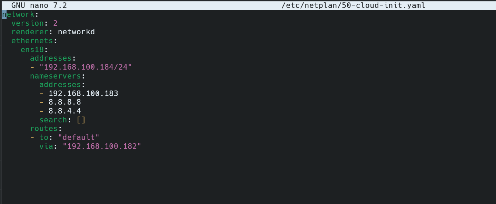
- `via: "192.168.100.182"` — el gateway es el router-fw. Todo el tráfico entre VMs pasa por las reglas iptables de segmentación. Esta VM no tiene ruta de rescate `/32` porque después del hardening solo será accesible desde el router-fw.

```bash
sudo netplan apply
```

### 7.2 Hostname e Instalación

```bash
sudo hostnamectl set-hostname web-dmz
exec bash
sudo apt update && sudo apt upgrade -y
sudo apt install -y nginx curl wget ufw openssl
```

- `nginx` — servidor web de alto rendimiento y proxy inverso. Puede servir archivos estáticos (como nuestro portal HTML) y simultáneamente reenviar peticiones a otros servicios (como la API Node.js). Es más eficiente que Apache para este tipo de arquitectura.
- `openssl` — biblioteca y herramienta de criptografía. Se usa para generar el certificado TLS autofirmado para HTTPS.

### 7.3 Configuración DNS en systemd-resolved

```bash
sudo mkdir -p /etc/systemd/resolved.conf.d
sudo nano /etc/systemd/resolved.conf.d/bancoseguro.conf
```
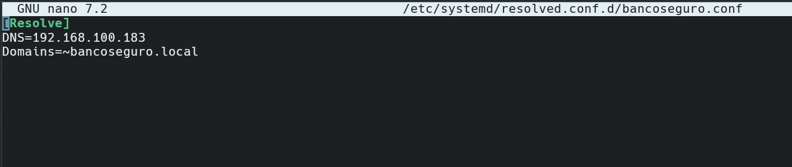
```ini
[Resolve]
DNS=192.168.100.183
Domains=~bancoseguro.local
```

```bash
sudo systemctl restart systemd-resolved
```

### 7.4 Generación del Certificado TLS Autofirmado

```bash
sudo openssl req -x509 -nodes -days 365 \
  -newkey rsa:2048 \
  -keyout /etc/ssl/private/bancoseguro.key \
  -out /etc/ssl/certs/bancoseguro.crt \
  -subj "/C=BO/ST=Chuquisaca/L=Sucre/O=Banco Seguro/CN=bancoseguro.local"
```

- `openssl req` — subcomando de OpenSSL para gestionar solicitudes de certificado (CSR) y certificados.
- `-x509` — genera directamente un certificado X.509 autofirmado en lugar de una solicitud CSR. X.509 es el estándar de la industria para certificados TLS/SSL.
- `-nodes` — "no DES" — no cifra la clave privada con una contraseña. Necesario para que Nginx pueda leer la clave automáticamente al iniciar sin pedir contraseña interactivamente.
- `-days 365` — el certificado es válido por 365 días. Después de este plazo, los navegadores mostrarán advertencia de certificado expirado.
- `-newkey rsa:2048` — genera una nueva clave RSA de 2048 bits simultáneamente con el certificado. 2048 bits es el mínimo recomendado actualmente para RSA.
- `-keyout /etc/ssl/private/bancoseguro.key` — guarda la clave privada en esta ruta. El directorio `/etc/ssl/private/` tiene permisos `710` (solo root puede escribir, grupo ssl-cert puede leer) para proteger la clave privada.
- `-out /etc/ssl/certs/bancoseguro.crt` — guarda el certificado público en esta ruta.
- `-subj "/C=BO/ST=Chuquisaca/L=Sucre/O=Banco Seguro/CN=bancoseguro.local"` — información del certificado sin prompt interactivo. `C`=País, `ST`=Estado/Departamento, `L`=Ciudad/Localidad, `O`=Organización, `CN`=Common Name (nombre principal del servidor, debe coincidir con el dominio).

### 7.5 Configuración de Nginx

```bash
sudo mkdir -p /var/www/bancoseguro
```

- `mkdir -p /var/www/bancoseguro` — crea el directorio donde se almacenará el portal bancario. `/var/www/` es la ubicación estándar para sitios web en sistemas Debian/Ubuntu.

```bash
sudo nano /etc/nginx/sites-available/bancoseguro
```
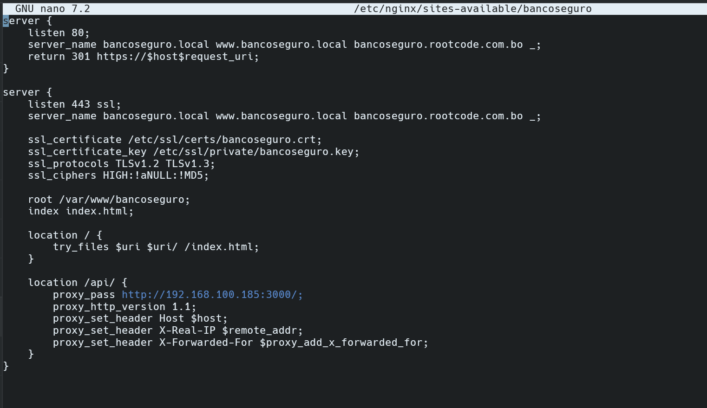
- `/etc/nginx/sites-available/` — directorio donde se guardan las configuraciones de todos los sitios disponibles en Nginx. Los archivos aquí no se aplican directamente hasta que se crea un enlace simbólico en `sites-enabled/`.

Contenido completo del archivo:

```nginx
server {
    listen 80;
    server_name bancoseguro.local www.bancoseguro.local bancoseguro.rootcode.com.bo _;
    return 301 https://$host$request_uri;
}

server {
    listen 443 ssl;
    server_name bancoseguro.local www.bancoseguro.local bancoseguro.rootcode.com.bo _;

    ssl_certificate /etc/ssl/certs/bancoseguro.crt;
    ssl_certificate_key /etc/ssl/private/bancoseguro.key;
    ssl_protocols TLSv1.2 TLSv1.3;
    ssl_ciphers HIGH:!aNULL:!MD5;

    root /var/www/bancoseguro;
    index index.html;

    location / {
        try_files $uri $uri/ /index.html;
    }

    location /api/ {
        proxy_pass http://192.168.100.185:3000/;
        proxy_http_version 1.1;
        proxy_set_header Host $host;
        proxy_set_header X-Real-IP $remote_addr;
        proxy_set_header X-Forwarded-For $proxy_add_x_forwarded_for;
    }
}
```

- `server { listen 80; ... return 301 https://... }` — primer bloque servidor. Escucha en el puerto 80 (HTTP) y redirige permanentemente todas las peticiones a HTTPS. El código 301 indica redirección permanente (los navegadores la recuerdan).
- `server_name bancoseguro.local www.bancoseguro.local bancoseguro.rootcode.com.bo _` — lista de nombres de host para los que este bloque responde. El `_` es un comodín que captura cualquier nombre no coincidente, asegurando que Nginx siempre responde sin importar cómo se acceda.
- `listen 443 ssl` — escucha en el puerto 443 (HTTPS estándar) con TLS habilitado.
- `ssl_certificate` y `ssl_certificate_key` — rutas al certificado público y clave privada generados con OpenSSL.
- `ssl_protocols TLSv1.2 TLSv1.3` — solo permite versiones modernas y seguras de TLS. TLS 1.0 y 1.1 están deprecados y tienen vulnerabilidades conocidas.
- `ssl_ciphers HIGH:!aNULL:!MD5` — solo algoritmos de cifrado fuertes. `HIGH` incluye suites de cifrado robustas. `!aNULL` excluye cifrado sin autenticación. `!MD5` excluye el algoritmo MD5, considerado inseguro.
- `root /var/www/bancoseguro` — directorio raíz del sitio web. Nginx buscará archivos aquí.
- `index index.html` — archivo por defecto a servir cuando se pide un directorio.
- `location / { try_files $uri $uri/ /index.html; }` — bloque que maneja todas las rutas. `try_files` intenta: primero el archivo exacto (`$uri`), luego el directorio (`$uri/`), y si no existe ninguno, sirve `index.html`. Esto es necesario para SPA (Single Page Applications) donde el enrutamiento lo maneja JavaScript del lado del cliente.
- `location /api/ { proxy_pass http://192.168.100.185:3000/; }` — bloque para las rutas `/api/*`. Nginx actúa como proxy inverso: recibe la petición del cliente, la reenvía al backend Node.js en app-server, recibe la respuesta y la devuelve al cliente. El cliente nunca contacta directamente al app-server.
- `proxy_http_version 1.1` — usa HTTP/1.1 para comunicarse con el backend, necesario para soporte de conexiones keep-alive.
- `proxy_set_header Host $host` — pasa el nombre de host original al backend para que sepa a qué sitio se accedía.
- `proxy_set_header X-Real-IP $remote_addr` — pasa la IP real del cliente al backend. Sin esto, la API solo vería la IP de Nginx (127.0.0.1 o la IP interna) en lugar de la IP del usuario real.
- `proxy_set_header X-Forwarded-For $proxy_add_x_forwarded_for` — encabezado estándar para proxies que lista todas las IPs por las que pasó la petición.

```bash
sudo ln -s /etc/nginx/sites-available/bancoseguro /etc/nginx/sites-enabled/
```

- `ln -s` — crea un enlace simbólico (acceso directo). Nginx lee los sitios activos desde `sites-enabled/`, pero los archivos se editan en `sites-available/`. El enlace simbólico conecta ambos sin duplicar el archivo.

```bash
sudo rm /etc/nginx/sites-enabled/default
```

- `rm` — elimina un archivo.
- `/etc/nginx/sites-enabled/default` — configuración de sitio por defecto de Nginx que sirve la página de bienvenida. La eliminamos para que nuestra configuración `bancoseguro` sea la única activa y no haya conflictos de `server_name`.

```bash
sudo nginx -t
```

- `nginx -t` — verifica la sintaxis de toda la configuración de Nginx sin aplicarla. Es una comprobación de seguridad: si hay errores de sintaxis, los muestra sin reiniciar Nginx. Siempre debe ejecutarse antes de `systemctl restart nginx` para evitar dejar Nginx caído por un error tipográfico.

```bash
sudo systemctl restart nginx
```

- `systemctl restart nginx` — detiene y vuelve a iniciar Nginx, aplicando toda la configuración nueva.

### 7.6 Portal Bancario Completo

```bash
sudo nano /var/www/bancoseguro/index.html
```
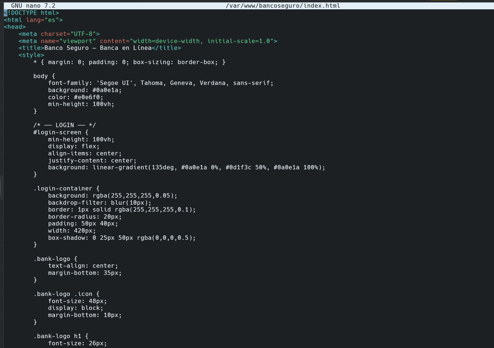
Contenido completo del archivo HTML (portal bancario con CSS y JavaScript integrados):

```html
<!DOCTYPE html>
<html lang="es">
<head>
    <meta charset="UTF-8">
    <meta name="viewport" content="width=device-width, initial-scale=1.0">
    <title>Banco Seguro — Banca en Línea</title>
    <style>
        * { margin: 0; padding: 0; box-sizing: border-box; }
        body {
            font-family: 'Segoe UI', Tahoma, Geneva, Verdana, sans-serif;
            background: #0a0e1a;
            color: #e0e6f0;
            min-height: 100vh;
        }
        #login-screen {
            min-height: 100vh;
            display: flex;
            align-items: center;
            justify-content: center;
            background: linear-gradient(135deg, #0a0e1a 0%, #0d1f3c 50%, #0a0e1a 100%);
        }
        .login-container {
            background: rgba(255,255,255,0.05);
            backdrop-filter: blur(10px);
            border: 1px solid rgba(255,255,255,0.1);
            border-radius: 20px;
            padding: 50px 40px;
            width: 420px;
            box-shadow: 0 25px 50px rgba(0,0,0,0.5);
        }
        .bank-logo { text-align: center; margin-bottom: 35px; }
        .bank-logo .icon { font-size: 48px; display: block; margin-bottom: 10px; }
        .bank-logo h1 { font-size: 26px; font-weight: 700; color: #4a9eff; letter-spacing: 1px; }
        .bank-logo p { font-size: 13px; color: #8899aa; margin-top: 4px; }
        .form-group { margin-bottom: 20px; }
        .form-group label { display: block; font-size: 13px; color: #8899aa; margin-bottom: 8px; text-transform: uppercase; letter-spacing: 0.5px; }
        .form-group input { width: 100%; padding: 14px 16px; background: rgba(255,255,255,0.08); border: 1px solid rgba(255,255,255,0.15); border-radius: 10px; color: #e0e6f0; font-size: 15px; transition: all 0.3s; outline: none; }
        .form-group input:focus { border-color: #4a9eff; background: rgba(74,158,255,0.1); box-shadow: 0 0 0 3px rgba(74,158,255,0.15); }
        .btn-login { width: 100%; padding: 15px; background: linear-gradient(135deg, #1a6fff, #0047cc); border: none; border-radius: 10px; color: white; font-size: 16px; font-weight: 600; cursor: pointer; transition: all 0.3s; margin-top: 10px; }
        .btn-login:hover { transform: translateY(-2px); box-shadow: 0 8px 25px rgba(26,111,255,0.4); }
        .btn-login:disabled { opacity: 0.6; cursor: not-allowed; transform: none; }
        .error-msg { background: rgba(255,59,48,0.15); border: 1px solid rgba(255,59,48,0.3); color: #ff6b6b; padding: 12px 16px; border-radius: 8px; font-size: 14px; margin-top: 15px; display: none; text-align: center; }
        .login-footer { text-align: center; margin-top: 25px; font-size: 12px; color: #556677; }
        #dashboard-screen { display: none; }
        .navbar { background: rgba(10,14,26,0.95); backdrop-filter: blur(10px); border-bottom: 1px solid rgba(255,255,255,0.08); padding: 0 30px; height: 65px; display: flex; align-items: center; justify-content: space-between; position: sticky; top: 0; z-index: 100; }
        .navbar-brand { display: flex; align-items: center; gap: 10px; font-size: 20px; font-weight: 700; color: #4a9eff; }
        .navbar-user { display: flex; align-items: center; gap: 15px; }
        .user-badge { background: rgba(74,158,255,0.15); border: 1px solid rgba(74,158,255,0.3); padding: 8px 16px; border-radius: 20px; font-size: 14px; color: #4a9eff; }
        .btn-logout { background: rgba(255,59,48,0.15); border: 1px solid rgba(255,59,48,0.3); color: #ff6b6b; padding: 8px 16px; border-radius: 20px; cursor: pointer; font-size: 14px; transition: all 0.3s; }
        .btn-logout:hover { background: rgba(255,59,48,0.25); }
        .dashboard-content { max-width: 1100px; margin: 0 auto; padding: 30px 20px; }
        .welcome-msg { font-size: 24px; font-weight: 600; margin-bottom: 25px; }
        .welcome-msg span { color: #4a9eff; }
        .cuentas-grid { display: grid; grid-template-columns: repeat(auto-fit, minmax(300px, 1fr)); gap: 20px; margin-bottom: 30px; }
        .cuenta-card { background: linear-gradient(135deg, #1a2a4a, #0d1f3c); border: 1px solid rgba(74,158,255,0.2); border-radius: 16px; padding: 25px; cursor: pointer; transition: all 0.3s; }
        .cuenta-card:hover { transform: translateY(-3px); box-shadow: 0 15px 35px rgba(74,158,255,0.15); border-color: rgba(74,158,255,0.5); }
        .cuenta-card.selected { border-color: #4a9eff; box-shadow: 0 0 0 2px rgba(74,158,255,0.3); }
        .cuenta-tipo { font-size: 12px; text-transform: uppercase; letter-spacing: 1px; color: #4a9eff; margin-bottom: 8px; }
        .cuenta-numero { font-size: 15px; color: #8899aa; margin-bottom: 15px; font-family: monospace; letter-spacing: 2px; }
        .cuenta-saldo { font-size: 32px; font-weight: 700; }
        .cuenta-saldo .currency { font-size: 18px; color: #4a9eff; margin-right: 5px; }
        .acciones-section { display: grid; grid-template-columns: 1fr 1fr; gap: 20px; margin-bottom: 30px; }
        .card { background: rgba(255,255,255,0.03); border: 1px solid rgba(255,255,255,0.08); border-radius: 16px; padding: 25px; }
        .card h3 { font-size: 16px; color: #4a9eff; margin-bottom: 20px; }
        .form-row { margin-bottom: 15px; }
        .form-row label { display: block; font-size: 12px; color: #8899aa; margin-bottom: 6px; text-transform: uppercase; }
        .form-row input, .form-row select { width: 100%; padding: 11px 14px; background: rgba(255,255,255,0.06); border: 1px solid rgba(255,255,255,0.12); border-radius: 8px; color: #e0e6f0; font-size: 14px; outline: none; transition: all 0.3s; }
        .form-row input:focus, .form-row select:focus { border-color: #4a9eff; background: rgba(74,158,255,0.08); }
        .btn-action { width: 100%; padding: 12px; background: linear-gradient(135deg, #1a6fff, #0047cc); border: none; border-radius: 8px; color: white; font-size: 14px; font-weight: 600; cursor: pointer; transition: all 0.3s; margin-top: 5px; }
        .btn-action:hover { transform: translateY(-1px); box-shadow: 0 5px 15px rgba(26,111,255,0.3); }
        .result-msg { padding: 10px 14px; border-radius: 8px; font-size: 13px; margin-top: 12px; display: none; }
        .result-msg.success { background: rgba(52,199,89,0.15); border: 1px solid rgba(52,199,89,0.3); color: #34c759; }
        .result-msg.error { background: rgba(255,59,48,0.15); border: 1px solid rgba(255,59,48,0.3); color: #ff6b6b; }
        .transacciones-section { margin-bottom: 30px; }
        .transacciones-section h3 { font-size: 18px; margin-bottom: 15px; }
        .transaccion-item { background: rgba(255,255,255,0.03); border: 1px solid rgba(255,255,255,0.06); border-radius: 12px; padding: 16px 20px; margin-bottom: 10px; display: flex; justify-content: space-between; align-items: center; }
        .transaccion-item:hover { background: rgba(255,255,255,0.05); }
        .transaccion-info { flex: 1; }
        .transaccion-tipo { font-size: 13px; color: #4a9eff; text-transform: uppercase; }
        .transaccion-desc { font-size: 15px; margin: 4px 0; }
        .transaccion-fecha { font-size: 12px; color: #556677; }
        .transaccion-monto { font-size: 18px; font-weight: 700; }
        .transaccion-monto.ingreso { color: #34c759; }
        .transaccion-monto.egreso { color: #ff6b6b; }
        .empty-state { text-align: center; padding: 40px; color: #556677; }
        .loading { text-align: center; padding: 20px; color: #4a9eff; }
        @media (max-width: 768px) {
            .acciones-section { grid-template-columns: 1fr; }
            .login-container { width: 90%; padding: 35px 25px; }
            .navbar { padding: 0 15px; }
        }
    </style>
</head>
<body>
    <!-- PANTALLA DE LOGIN -->
    <div id="login-screen">
        <div class="login-container">
            <div class="bank-logo">
                <span class="icon">🏦</span>
                <h1>BANCO SEGURO</h1>
                <p>Banca en Línea — Acceso Seguro</p>
            </div>
            <div class="form-group">
                <label>Usuario</label>
                <input type="text" id="input-username" placeholder="juan.perez" autocomplete="off"/>
            </div>
            <div class="form-group">
                <label>Contraseña</label>
                <input type="password" id="input-password" placeholder="••••••••"/>
            </div>
            <button class="btn-login" id="btn-login" onclick="login()">Iniciar Sesión</button>
            <div class="error-msg" id="login-error"></div>
            <div class="login-footer">🔒 Conexión cifrada con TLS 1.3 — bancoseguro.local</div>
        </div>
    </div>

    <!-- PANTALLA DE DASHBOARD -->
    <div id="dashboard-screen">
        <nav class="navbar">
            <div class="navbar-brand">🏦 Banco Seguro</div>
            <div class="navbar-user">
                <span class="user-badge" id="navbar-username">👤 Usuario</span>
                <button class="btn-logout" onclick="logout()">Cerrar Sesión</button>
            </div>
        </nav>
        <div class="dashboard-content">
            <div class="welcome-msg">Bienvenido, <span id="welcome-nombre">Usuario</span></div>
            <div class="cuentas-grid" id="cuentas-grid"><div class="loading">Cargando cuentas...</div></div>
            <div class="acciones-section">
                <div class="card">
                    <h3>💸 Nueva Transferencia</h3>
                    <div class="form-row">
                        <label>Cuenta Origen</label>
                        <select id="select-origen"><option value="">Seleccionar cuenta...</option></select>
                    </div>
                    <div class="form-row">
                        <label>Cuenta Destino</label>
                        <input type="text" id="input-destino" placeholder="Número de cuenta destino"/>
                    </div>
                    <div class="form-row">
                        <label>Monto (Bs.)</label>
                        <input type="number" id="input-monto" placeholder="0.00" min="0.01" step="0.01"/>
                    </div>
                    <div class="form-row">
                        <label>Descripción (opcional)</label>
                        <input type="text" id="input-descripcion" placeholder="Ej: Pago alquiler"/>
                    </div>
                    <button class="btn-action" onclick="transferir()">Realizar Transferencia</button>
                    <div class="result-msg" id="transferencia-result"></div>
                </div>
                <div class="card">
                    <h3>🔍 Consultar Saldo</h3>
                    <div class="form-row">
                        <label>Número de Cuenta</label>
                        <select id="select-saldo-cuenta"><option value="">Seleccionar cuenta...</option></select>
                    </div>
                    <button class="btn-action" onclick="consultarSaldo()">Consultar Saldo</button>
                    <div id="saldo-resultado" style="margin-top:15px; display:none;">
                        <div style="background:rgba(74,158,255,0.1);border:1px solid rgba(74,158,255,0.3);border-radius:10px;padding:20px;text-align:center;">
                            <div style="font-size:13px;color:#8899aa;margin-bottom:8px;">SALDO DISPONIBLE</div>
                            <div style="font-size:36px;font-weight:700;color:#4a9eff;">Bs. <span id="saldo-monto">0.00</span></div>
                            <div style="font-size:13px;color:#8899aa;margin-top:8px;">Cuenta: <span id="saldo-cuenta-num" style="font-family:monospace;"></span></div>
                        </div>
                    </div>
                </div>
            </div>
            <div class="transacciones-section">
                <h3>📋 Últimas Transacciones</h3>
                <div id="transacciones-lista"><div class="empty-state">Selecciona una cuenta para ver las transacciones</div></div>
            </div>
        </div>
    </div>

    <script>
        // URL base de la API - apunta al subdominio público del proyecto
        const API = 'https://bancoseguro.rootcode.com.bo/api';
        let token = localStorage.getItem('token');
        let clienteData = null;
        let cuentasData = [];

        // Al cargar la página: verificar si hay sesión activa guardada
        window.onload = () => {
            token = localStorage.getItem('token');
            if (token) mostrarDashboard();
            // Permitir login con la tecla Enter
            document.getElementById('input-password')
                .addEventListener('keypress', (e) => { if (e.key === 'Enter') login(); });
        };

        // Función de login: envía credenciales a la API y guarda el token JWT
        async function login() {
            const username = document.getElementById('input-username').value.trim();
            const password = document.getElementById('input-password').value;
            const btnLogin = document.getElementById('btn-login');
            const errorDiv = document.getElementById('login-error');
            if (!username || !password) { mostrarError(errorDiv, 'Por favor ingresa usuario y contraseña'); return; }
            btnLogin.disabled = true;
            btnLogin.textContent = 'Verificando...';
            errorDiv.style.display = 'none';
            try {
                const res = await fetch(`${API}/login`, {
                    method: 'POST',
                    headers: { 'Content-Type': 'application/json' },
                    body: JSON.stringify({ username, password })
                });
                const data = await res.json();
                if (!res.ok) { mostrarError(errorDiv, data.error || 'Error de autenticación'); return; }
                token = data.token;
                clienteData = data.cliente;
                localStorage.setItem('token', token);
                localStorage.setItem('cliente', JSON.stringify(clienteData));
                mostrarDashboard();
            } catch (err) {
                mostrarError(errorDiv, 'Error de conexión con el servidor');
            } finally {
                btnLogin.disabled = false;
                btnLogin.textContent = 'Iniciar Sesión';
            }
        }

        // Muestra el dashboard cargando las cuentas del cliente
        async function mostrarDashboard() {
            const clienteStr = localStorage.getItem('cliente');
            if (clienteStr) clienteData = JSON.parse(clienteStr);
            document.getElementById('login-screen').style.display = 'none';
            document.getElementById('dashboard-screen').style.display = 'block';
            if (clienteData) {
                document.getElementById('welcome-nombre').textContent = clienteData.nombre;
                document.getElementById('navbar-username').textContent = '👤 ' + clienteData.username;
            }
            await cargarCuentas();
        }

        // Carga las cuentas del cliente desde la API usando el token JWT
        async function cargarCuentas() {
            try {
                const res = await fetch(`${API}/cuentas`, { headers: { 'Authorization': 'Bearer ' + token } });
                if (res.status === 401) { logout(); return; }
                cuentasData = await res.json();
                renderCuentas();
                llenarSelects();
                if (cuentasData.length > 0) cargarTransacciones(cuentasData[0].numero_cuenta);
            } catch (err) {
                document.getElementById('cuentas-grid').innerHTML = '<div class="empty-state">Error cargando cuentas</div>';
            }
        }

        // Renderiza las tarjetas de cuenta en el dashboard
        function renderCuentas() {
            const grid = document.getElementById('cuentas-grid');
            if (cuentasData.length === 0) { grid.innerHTML = '<div class="empty-state">No tienes cuentas registradas</div>'; return; }
            grid.innerHTML = cuentasData.map((c, i) => `
                <div class="cuenta-card ${i === 0 ? 'selected' : ''}" onclick="seleccionarCuenta('${c.numero_cuenta}', this)">
                    <div class="cuenta-tipo">Cuenta ${c.tipo}</div>
                    <div class="cuenta-numero">${formatCuenta(c.numero_cuenta)}</div>
                    <div class="cuenta-saldo"><span class="currency">Bs.</span>${parseFloat(c.saldo).toLocaleString('es-BO', {minimumFractionDigits: 2})}</div>
                </div>`).join('');
        }

        // Al hacer clic en una tarjeta de cuenta, carga sus transacciones
        function seleccionarCuenta(numeroCuenta, elemento) {
            document.querySelectorAll('.cuenta-card').forEach(c => c.classList.remove('selected'));
            elemento.classList.add('selected');
            cargarTransacciones(numeroCuenta);
        }

        // Llena los selectores de cuentas en los formularios de acciones
        function llenarSelects() {
            const opciones = cuentasData.map(c =>
                `<option value="${c.numero_cuenta}">${formatCuenta(c.numero_cuenta)} — Bs. ${parseFloat(c.saldo).toFixed(2)}</option>`
            ).join('');
            document.getElementById('select-origen').innerHTML = '<option value="">Seleccionar cuenta...</option>' + opciones;
            document.getElementById('select-saldo-cuenta').innerHTML = '<option value="">Seleccionar cuenta...</option>' + opciones;
        }

        // Carga el historial de transacciones de una cuenta específica
        async function cargarTransacciones(numeroCuenta) {
            const lista = document.getElementById('transacciones-lista');
            lista.innerHTML = '<div class="loading">Cargando transacciones...</div>';
            try {
                const res = await fetch(`${API}/transacciones/${numeroCuenta}`, { headers: { 'Authorization': 'Bearer ' + token } });
                if (res.status === 401) { logout(); return; }
                const transacciones = await res.json();
                if (transacciones.length === 0) { lista.innerHTML = '<div class="empty-state">No hay transacciones para esta cuenta</div>'; return; }
                lista.innerHTML = transacciones.map(t => {
                    const esIngreso = t.cuenta_destino === numeroCuenta;
                    const signo = esIngreso ? '+' : '-';
                    const clase = esIngreso ? 'ingreso' : 'egreso';
                    const fecha = new Date(t.fecha).toLocaleDateString('es-BO', { day: '2-digit', month: 'short', year: 'numeric', hour: '2-digit', minute: '2-digit' });
                    return `<div class="transaccion-item">
                        <div class="transaccion-info">
                            <div class="transaccion-tipo">${t.tipo}</div>
                            <div class="transaccion-desc">${t.descripcion || 'Sin descripción'}</div>
                            <div class="transaccion-fecha">${fecha} — ${esIngreso ? 'De: ' + t.cuenta_origen : 'A: ' + t.cuenta_destino}</div>
                        </div>
                        <div class="transaccion-monto ${clase}">${signo} Bs. ${parseFloat(t.monto).toLocaleString('es-BO', {minimumFractionDigits: 2})}</div>
                    </div>`;
                }).join('');
            } catch (err) { lista.innerHTML = '<div class="empty-state">Error cargando transacciones</div>'; }
        }

        // Realiza una transferencia entre cuentas validando los campos
        async function transferir() {
            const cuenta_origen = document.getElementById('select-origen').value;
            const cuenta_destino = document.getElementById('input-destino').value.trim();
            const monto = parseFloat(document.getElementById('input-monto').value);
            const descripcion = document.getElementById('input-descripcion').value.trim();
            const resultDiv = document.getElementById('transferencia-result');
            if (!cuenta_origen || !cuenta_destino || !monto || monto <= 0) { mostrarResultado(resultDiv, 'error', 'Completa todos los campos correctamente'); return; }
            try {
                const res = await fetch(`${API}/transferir`, {
                    method: 'POST',
                    headers: { 'Content-Type': 'application/json', 'Authorization': 'Bearer ' + token },
                    body: JSON.stringify({ cuenta_origen, cuenta_destino, monto, descripcion })
                });
                const data = await res.json();
                if (!res.ok) { mostrarResultado(resultDiv, 'error', data.error); return; }
                mostrarResultado(resultDiv, 'success', `✅ Transferencia de Bs. ${monto.toFixed(2)} realizada exitosamente`);
                document.getElementById('input-destino').value = '';
                document.getElementById('input-monto').value = '';
                document.getElementById('input-descripcion').value = '';
                await cargarCuentas();
            } catch (err) { mostrarResultado(resultDiv, 'error', 'Error de conexión'); }
        }

        // Consulta el saldo de una cuenta específica
        async function consultarSaldo() {
            const cuenta = document.getElementById('select-saldo-cuenta').value;
            const resultDiv = document.getElementById('saldo-resultado');
            if (!cuenta) { alert('Selecciona una cuenta'); return; }
            try {
                const res = await fetch(`${API}/saldo/${cuenta}`, { headers: { 'Authorization': 'Bearer ' + token } });
                const data = await res.json();
                if (!res.ok) return;
                document.getElementById('saldo-monto').textContent = parseFloat(data.saldo).toLocaleString('es-BO', {minimumFractionDigits: 2});
                document.getElementById('saldo-cuenta-num').textContent = formatCuenta(data.numero_cuenta);
                resultDiv.style.display = 'block';
            } catch (err) { console.error(err); }
        }

        // Cierra sesión limpiando el localStorage y volviendo al login
        function logout() {
            localStorage.removeItem('token');
            localStorage.removeItem('cliente');
            token = null; clienteData = null;
            document.getElementById('dashboard-screen').style.display = 'none';
            document.getElementById('login-screen').style.display = 'flex';
            document.getElementById('input-username').value = '';
            document.getElementById('input-password').value = '';
        }

        // Formatea número de cuenta: 1001234567 → 1001 234 567
        function formatCuenta(num) { return num.replace(/(\d{4})(\d{3})(\d{3})/, '$1 $2 $3'); }
        function mostrarError(div, msg) { div.textContent = msg; div.style.display = 'block'; }
        function mostrarResultado(div, tipo, msg) {
            div.textContent = msg;
            div.className = 'result-msg ' + tipo;
            div.style.display = 'block';
            setTimeout(() => div.style.display = 'none', 5000);
        }
    </script>
</body>
</html>
```

Aplicamos permisos correctos:

```bash
sudo chown -R www-data:www-data /var/www/bancoseguro
```

- `chown` — cambia el propietario (owner) de archivos y directorios.
- `-R` — aplica el cambio recursivamente a todos los archivos y subdirectorios dentro de `/var/www/bancoseguro`.
- `www-data:www-data` — establece tanto el usuario propietario como el grupo propietario en `www-data`, que es el usuario del sistema bajo el cual corre Nginx. Necesario para que Nginx pueda leer y servir los archivos del portal.

```bash
sudo chmod -R 755 /var/www/bancoseguro
```

- `chmod` — cambia los permisos de archivos y directorios.
- `-R` — aplica recursivamente.
- `755` — permisos en formato octal: el propietario (`www-data`) puede leer/escribir/ejecutar (7), el grupo y otros solo pueden leer/ejecutar (5). El permiso de "ejecutar" en directorios significa poder entrar en ellos.

```bash
sudo systemctl restart nginx
```

### 7.7 Configuración UFW

```bash
sudo ufw default deny incoming
sudo ufw default allow outgoing
sudo ufw allow 22/tcp
sudo ufw allow 80/tcp
sudo ufw allow 443/tcp
sudo ufw enable
```
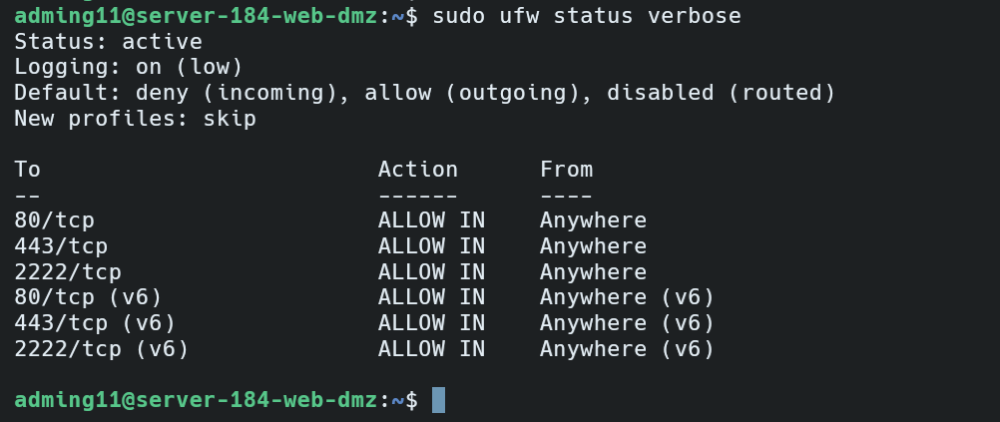

- `ufw allow 80/tcp` — permite HTTP entrante. Necesario para que la redirección 301 de HTTP a HTTPS funcione.
- `ufw allow 443/tcp` — permite HTTPS entrante. Es el puerto principal del portal bancario.

### 7.8 Bloqueo de ICMP desde cajero (before.rules)

UFW no bloquea ICMP (ping) con el comando `ufw deny from` por defecto, porque el ICMP se maneja antes de que UFW aplique sus reglas. Para bloquearlo necesitamos editar directamente las reglas de bajo nivel:

```bash
sudo nano /etc/ufw/before.rules
```
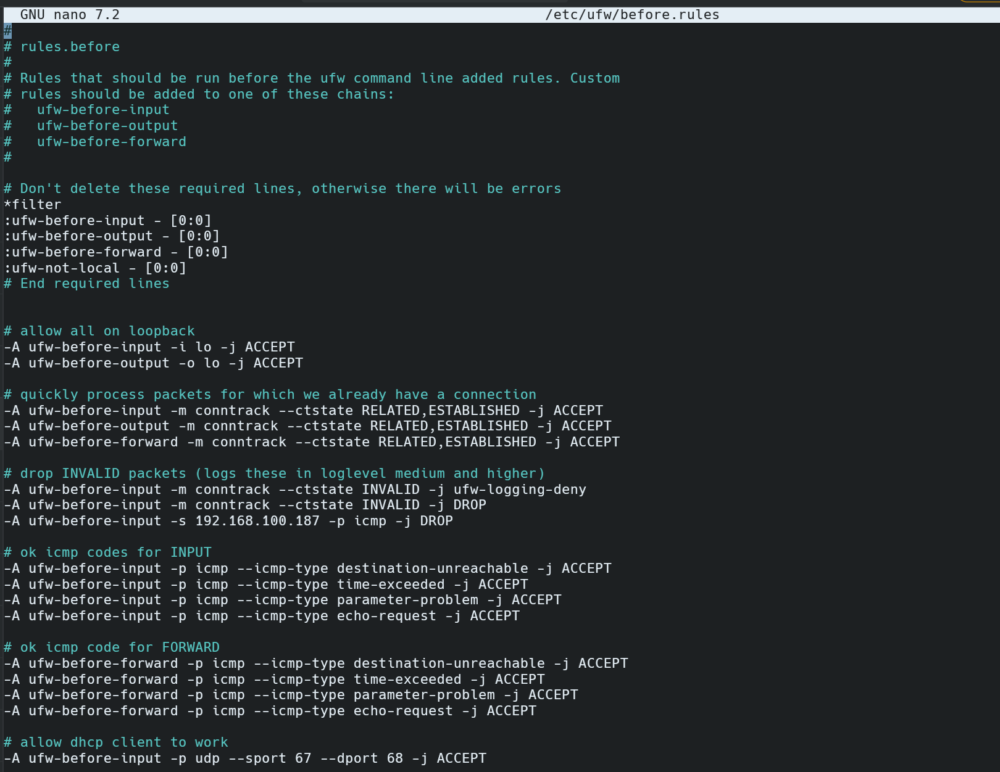
- `/etc/ufw/before.rules` — archivo de reglas iptables que UFW aplica **antes** de sus propias reglas generadas. Permite agregar reglas personalizadas que UFW no soporta nativamente, como el bloqueo de tipos específicos de ICMP.

Agregamos la siguiente línea **antes** de la sección `# ok icmp codes for INPUT`:

```
# Bloquear ping (ICMP echo request) desde cajero-terminal
-A ufw-before-input -s 192.168.100.187 -p icmp -j DROP

# ok icmp codes for INPUT
-A ufw-before-input -p icmp --icmp-type destination-unreachable -j ACCEPT
...
```

- `-A ufw-before-input` — agrega una regla a la cadena `ufw-before-input`, que se procesa antes que las reglas de UFW.
- `-s 192.168.100.187` — coincide solo con paquetes cuyo origen sea el cajero-terminal.
- `-p icmp` — coincide con el protocolo ICMP (el protocolo usado por `ping`).
- `-j DROP` — descarta el paquete silenciosamente. El cajero-terminal intentará hacer ping y no recibirá ninguna respuesta.
- La posición importa: debe estar **antes** de las reglas ACCEPT de ICMP, porque iptables aplica las reglas en orden y usa la primera que coincide.

```bash
sudo ufw reload
```

- `ufw reload` — recarga la configuración de UFW aplicando los cambios en `before.rules` sin deshabilitar el firewall completamente. Más seguro que `ufw disable && ufw enable`.

---

## 8. VM-4: app-server (192.168.100.185)

El `app-server` es el backend de la aplicación bancaria. Implementa una API REST con Node.js y Express que gestiona autenticación JWT, consulta de cuentas, historial de transacciones y transferencias entre cuentas.

### 8.1 Configuración de Red (Netplan)

```bash
sudo nano /etc/netplan/50-cloud-init.yaml
```

Contenido completo del archivo:

```yaml
network:
  version: 2
  renderer: networkd
  ethernets:
    ens18:
      addresses:
        - "192.168.100.185/24"
      nameservers:
        addresses:
          - 192.168.100.183
          - 8.8.8.8
          - 8.8.4.4
        search: []
      routes:
        - to: "default"
          via: "192.168.100.182"
```
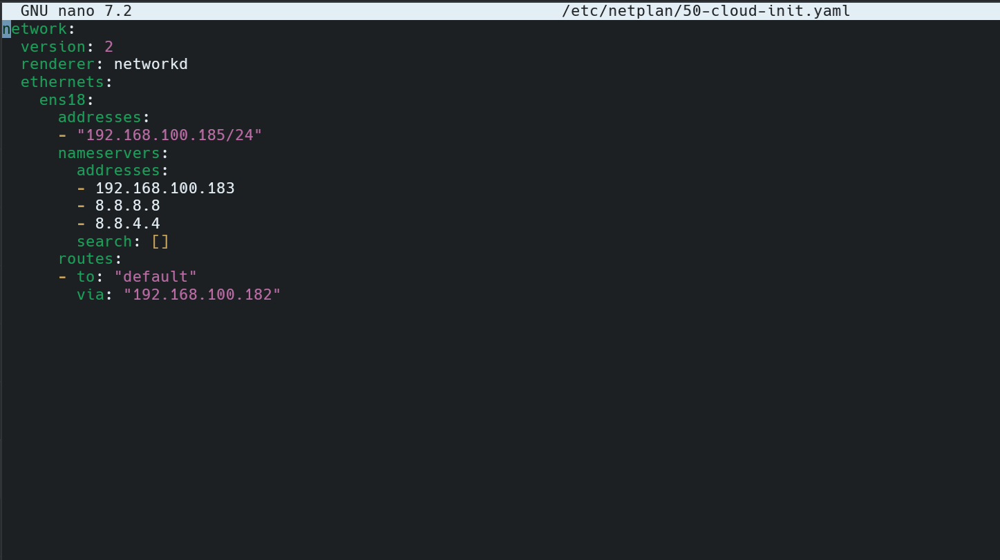
```bash
sudo netplan apply
```

### 8.2 Hostname e Instalación de Node.js

```bash
sudo hostnamectl set-hostname app-server
exec bash
sudo apt update && sudo apt upgrade -y
```

```bash
curl -fsSL https://deb.nodesource.com/setup_20.x | sudo -E bash -
```

- `curl -fsSL` — descarga silenciosamente (`-s`) sin mostrar progreso, falla silenciosamente en errores (`-f`), sigue redirecciones (`-L`).
- `https://deb.nodesource.com/setup_20.x` — script oficial de NodeSource para configurar el repositorio de Node.js versión 20 LTS en sistemas Debian/Ubuntu.
- `| sudo -E bash -` — el pipe envía la salida del curl como entrada a bash, ejecutando el script descargado. `-E` preserva las variables de entorno del usuario actual.

```bash
sudo apt install -y nodejs
```

- Instala Node.js 20 LTS desde el repositorio que configuramos. LTS (Long Term Support) significa soporte garantizado hasta abril 2026.

```bash
node --version
npm --version
```

- `node --version` — verifica que Node.js se instaló correctamente y muestra la versión (debe ser `v20.x.x`).
- `npm --version` — verifica que NPM (Node Package Manager) se instaló junto con Node.js. NPM se usa para gestionar las dependencias del proyecto.

### 8.3 Configuración DNS

```bash
sudo mkdir -p /etc/systemd/resolved.conf.d
sudo nano /etc/systemd/resolved.conf.d/bancoseguro.conf
```
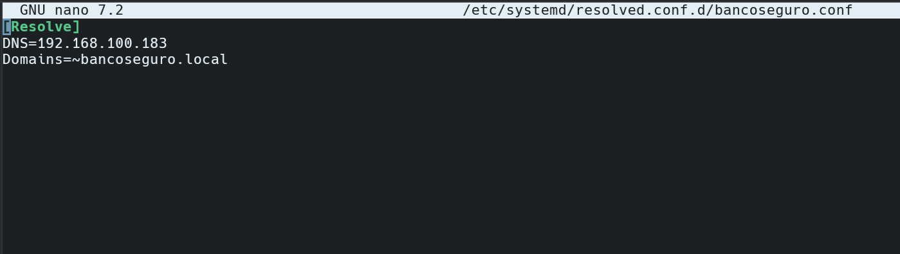
```ini
[Resolve]
DNS=192.168.100.183
Domains=~bancoseguro.local
```

```bash
sudo systemctl restart systemd-resolved
```

### 8.4 Creación del Proyecto Node.js

```bash
mkdir ~/banco-api
```

- `mkdir ~/banco-api` — crea el directorio del proyecto en el directorio home del usuario. `~` es un alias para `/home/adming11/`.

```bash
cd ~/banco-api
```

- `cd ~/banco-api` — entra al directorio del proyecto. Los comandos siguientes se ejecutarán dentro de este directorio.

```bash
npm init -y
```

- `npm init` — inicializa un nuevo proyecto Node.js, creando el archivo `package.json` que describe el proyecto y sus dependencias.
- `-y` — responde "sí" a todas las preguntas del asistente interactivo, usando valores por defecto. Genera el `package.json` sin interrupciones.

```bash
npm install express mysql2 bcryptjs jsonwebtoken cors dotenv
```

- `npm install` — descarga e instala los paquetes listados desde el registro de NPM, guardándolos en `node_modules/` y registrándolos en `package.json`.
- `express` — framework web minimalista para Node.js. Simplifica la creación de APIs REST con manejo de rutas, middlewares y respuestas HTTP.
- `mysql2` — driver de cliente MySQL/MariaDB para Node.js. Soporta Promises y async/await, permitiendo consultas a la base de datos de forma asíncrona sin bloquear el servidor.
- `bcryptjs` — implementación JavaScript de bcrypt para hashear contraseñas. bcrypt es un algoritmo diseñado específicamente para contraseñas: es lento por diseño, dificultando ataques de fuerza bruta.
- `jsonwebtoken` — implementación de JWT (JSON Web Tokens) para Node.js. Permite crear tokens firmados que el cliente puede usar para autenticarse en peticiones subsiguientes sin necesidad de enviar usuario/contraseña cada vez.
- `cors` — middleware de Express para manejar CORS (Cross-Origin Resource Sharing). Permite que el frontend (en web-dmz) haga peticiones a la API (en app-server) desde un origen diferente.
- `dotenv` — carga variables de entorno desde un archivo `.env` al objeto `process.env`. Permite separar la configuración del código y no hardcodear contraseñas en el código fuente.

### 8.5 Archivo de Variables de Entorno

```bash
nano ~/banco-api/.env
```
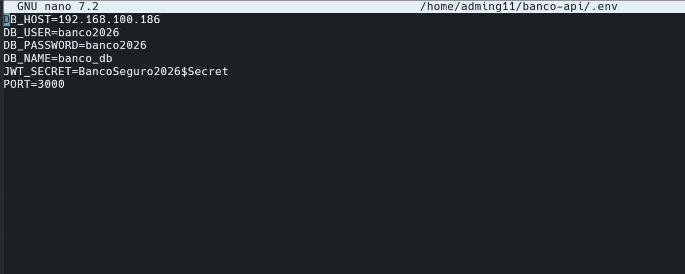
Contenido completo del archivo:

```env
DB_HOST=192.168.100.186
DB_USER=banco2026
DB_PASSWORD=banco2026
DB_NAME=banco_db
JWT_SECRET=BancoSeguro2026$Secret
PORT=3000
```

- `DB_HOST=192.168.100.186` — IP del servidor de base de datos (db-core). La API se conectará a esta dirección para todas las consultas.
- `DB_USER=banco2026` — usuario de MariaDB creado específicamente para la aplicación, con acceso restringido solo desde esta IP.
- `DB_PASSWORD=banco2026` — contraseña del usuario de base de datos.
- `DB_NAME=banco_db` — nombre de la base de datos del banco.
- `JWT_SECRET=BancoSeguro2026$Secret` — clave secreta usada para firmar y verificar los tokens JWT. Debe ser larga y aleatoria. Si alguien conoce esta clave puede generar tokens válidos falsos.
- `PORT=3000` — puerto donde escuchará el servidor Express.

### 8.6 API Bancaria Completa (index.js)

```bash
nano ~/banco-api/index.js
```
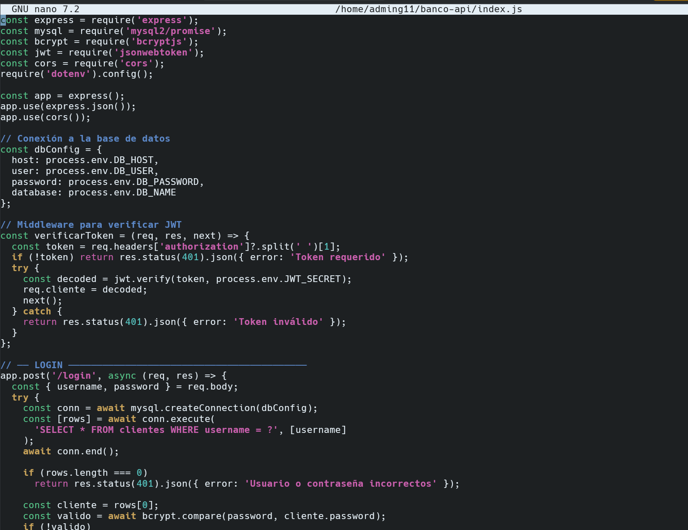
Contenido completo del archivo:

```javascript
const express = require('express');
const mysql = require('mysql2/promise');
const bcrypt = require('bcryptjs');
const jwt = require('jsonwebtoken');
const cors = require('cors');
require('dotenv').config();

const app = express();
app.use(express.json());
app.use(cors());

// Configuración de conexión a la base de datos
// Usa las variables de entorno del archivo .env
const dbConfig = {
  host: process.env.DB_HOST,
  user: process.env.DB_USER,
  password: process.env.DB_PASSWORD,
  database: process.env.DB_NAME
};

// Middleware de verificación JWT
// Se ejecuta antes de los endpoints protegidos
// Extrae el token del header: Authorization: Bearer <token>
// Verifica firma y expiración con la clave secreta
// Si es válido, adjunta los datos del cliente al request
const verificarToken = (req, res, next) => {
  const token = req.headers['authorization']?.split(' ')[1];
  if (!token) return res.status(401).json({ error: 'Token requerido' });
  try {
    const decoded = jwt.verify(token, process.env.JWT_SECRET);
    req.cliente = decoded;
    next();
  } catch {
    return res.status(401).json({ error: 'Token inválido' });
  }
};

// GET / — Estado del servicio
// Endpoint público sin autenticación para verificar que la API está activa
app.get('/', (req, res) => {
  res.json({ servicio: 'Banco Seguro API', version: '1.0', estado: 'activo' });
});

// POST /login — Autenticación del cliente
// Recibe { username, password } en el body
// Busca el cliente en la BD, verifica contraseña con bcrypt
// Si es correcto, genera y retorna un JWT válido por 8 horas
app.post('/login', async (req, res) => {
  const { username, password } = req.body;
  try {
    const conn = await mysql.createConnection(dbConfig);
    const [rows] = await conn.execute(
      'SELECT * FROM clientes WHERE username = ?', [username]
    );
    await conn.end();
    if (rows.length === 0)
      return res.status(401).json({ error: 'Usuario o contraseña incorrectos' });
    const cliente = rows[0];
    const valido = await bcrypt.compare(password, cliente.password);
    if (!valido)
      return res.status(401).json({ error: 'Usuario o contraseña incorrectos' });
    const token = jwt.sign(
      { id: cliente.id, username: cliente.username, nombre: cliente.nombre },
      process.env.JWT_SECRET,
      { expiresIn: '8h' }
    );
    res.json({
      token,
      cliente: { id: cliente.id, nombre: cliente.nombre, apellido: cliente.apellido, username: cliente.username }
    });
  } catch (err) {
    res.status(500).json({ error: 'Error del servidor: ' + err.message });
  }
});

// GET /perfil — Datos del cliente autenticado
// Protegido por JWT - solo el propio cliente puede ver su perfil
app.get('/perfil', verificarToken, async (req, res) => {
  try {
    const conn = await mysql.createConnection(dbConfig);
    const [rows] = await conn.execute(
      'SELECT id, nombre, apellido, email, username, created_at FROM clientes WHERE id = ?',
      [req.cliente.id]
    );
    await conn.end();
    res.json(rows[0]);
  } catch (err) { res.status(500).json({ error: err.message }); }
});

// GET /cuentas — Lista de cuentas del cliente autenticado
// Solo devuelve las cuentas que pertenecen al cliente del token
app.get('/cuentas', verificarToken, async (req, res) => {
  try {
    const conn = await mysql.createConnection(dbConfig);
    const [rows] = await conn.execute(
      'SELECT * FROM cuentas WHERE cliente_id = ?', [req.cliente.id]
    );
    await conn.end();
    res.json(rows);
  } catch (err) { res.status(500).json({ error: err.message }); }
});

// GET /saldo/:cuenta — Saldo de una cuenta específica
// Verifica que la cuenta pertenezca al cliente autenticado (seguridad)
app.get('/saldo/:cuenta', verificarToken, async (req, res) => {
  try {
    const conn = await mysql.createConnection(dbConfig);
    const [rows] = await conn.execute(
      'SELECT saldo, numero_cuenta, tipo FROM cuentas WHERE numero_cuenta = ? AND cliente_id = ?',
      [req.params.cuenta, req.cliente.id]
    );
    await conn.end();
    if (rows.length === 0) return res.status(404).json({ error: 'Cuenta no encontrada' });
    res.json(rows[0]);
  } catch (err) { res.status(500).json({ error: err.message }); }
});

// GET /transacciones/:cuenta — Últimas 20 transacciones de una cuenta
// Retorna transacciones donde la cuenta es origen O destino
// Ordenadas por fecha descendente (más recientes primero)
app.get('/transacciones/:cuenta', verificarToken, async (req, res) => {
  try {
    const conn = await mysql.createConnection(dbConfig);
    const [rows] = await conn.execute(
      `SELECT * FROM transacciones
       WHERE cuenta_origen = ? OR cuenta_destino = ?
       ORDER BY fecha DESC LIMIT 20`,
      [req.params.cuenta, req.params.cuenta]
    );
    await conn.end();
    res.json(rows);
  } catch (err) { res.status(500).json({ error: err.message }); }
});

// POST /transferir — Transferencia entre cuentas
// Validaciones: monto > 0, cuentas diferentes, cuenta origen del cliente,
// saldo suficiente, cuenta destino existe
// Operación atómica: descuenta, acredita y registra transacción
app.post('/transferir', verificarToken, async (req, res) => {
  const { cuenta_origen, cuenta_destino, monto, descripcion } = req.body;
  if (!cuenta_origen || !cuenta_destino || !monto || monto <= 0)
    return res.status(400).json({ error: 'Datos inválidos' });
  if (cuenta_origen === cuenta_destino)
    return res.status(400).json({ error: 'Las cuentas no pueden ser iguales' });
  try {
    const conn = await mysql.createConnection(dbConfig);
    const [origen] = await conn.execute(
      'SELECT * FROM cuentas WHERE numero_cuenta = ? AND cliente_id = ?',
      [cuenta_origen, req.cliente.id]
    );
    if (origen.length === 0) { await conn.end(); return res.status(403).json({ error: 'Cuenta origen no autorizada' }); }
    if (parseFloat(origen[0].saldo) < parseFloat(monto)) { await conn.end(); return res.status(400).json({ error: 'Saldo insuficiente' }); }
    const [destino] = await conn.execute(
      'SELECT * FROM cuentas WHERE numero_cuenta = ?', [cuenta_destino]
    );
    if (destino.length === 0) { await conn.end(); return res.status(404).json({ error: 'Cuenta destino no encontrada' }); }
    await conn.execute('UPDATE cuentas SET saldo = saldo - ? WHERE numero_cuenta = ?', [monto, cuenta_origen]);
    await conn.execute('UPDATE cuentas SET saldo = saldo + ? WHERE numero_cuenta = ?', [monto, cuenta_destino]);
    await conn.execute(
      'INSERT INTO transacciones (cuenta_origen, cuenta_destino, monto, tipo, descripcion) VALUES (?, ?, ?, ?, ?)',
      [cuenta_origen, cuenta_destino, monto, 'transferencia', descripcion || 'Transferencia']
    );
    await conn.end();
    res.json({ mensaje: 'Transferencia realizada exitosamente', monto, cuenta_origen, cuenta_destino });
  } catch (err) { res.status(500).json({ error: err.message }); }
});

// Inicia el servidor en el puerto definido en .env
app.listen(process.env.PORT, () => {
  console.log(`Banco API corriendo en puerto ${process.env.PORT}`);
});
```

### 8.7 Servicio systemd para la API

```bash
sudo nano /etc/systemd/system/banco-api.service
```
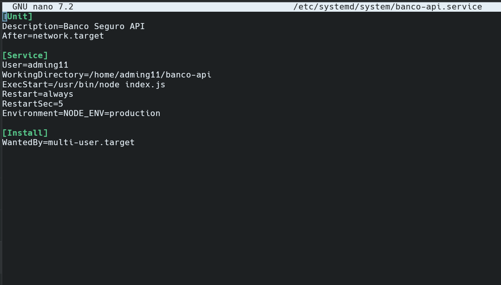
- `/etc/systemd/system/` — directorio donde se colocan los archivos de servicio personalizados de systemd. Los archivos aquí tienen prioridad sobre los del sistema.

Contenido completo del archivo:

```ini
[Unit]
Description=Banco Seguro API
After=network.target

[Service]
User=adming11
WorkingDirectory=/home/adming11/banco-api
ExecStart=/usr/bin/node index.js
Restart=always
RestartSec=5
Environment=NODE_ENV=production

[Install]
WantedBy=multi-user.target
```

- `[Unit]` — sección con metadatos y dependencias del servicio.
- `Description=Banco Seguro API` — descripción legible del servicio que aparece en `systemctl status`.
- `After=network.target` — este servicio debe iniciarse después de que la red esté disponible. Necesario porque la API intenta conectarse a MariaDB al arrancar.
- `[Service]` — sección que define cómo ejecutar el servicio.
- `User=adming11` — ejecuta el proceso con el usuario `adming11` en lugar de root. Principio de mínimo privilegio: si la API fuera comprometida, el atacante tendría permisos limitados de usuario normal.
- `WorkingDirectory=/home/adming11/banco-api` — directorio de trabajo donde se busca el archivo `index.js` y el archivo `.env`.
- `ExecStart=/usr/bin/node index.js` — comando para iniciar el servicio. Usa la ruta absoluta de `node` para evitar problemas con el PATH.
- `Restart=always` — si el proceso termina por cualquier razón (error, crash, señal), systemd lo reiniciará automáticamente. Garantiza alta disponibilidad de la API.
- `RestartSec=5` — espera 5 segundos antes de reiniciar tras un fallo, evitando un loop infinito de reinicios rápidos.
- `Environment=NODE_ENV=production` — establece la variable de entorno que indica a Express que está en modo producción (más eficiente, menos logs de debug).
- `[Install]` — sección que define cuándo activar el servicio.
- `WantedBy=multi-user.target` — activa el servicio en el nivel de ejecución multi-usuario (el normal del sistema, con red pero sin GUI).

```bash
sudo systemctl daemon-reload
```

- `systemctl daemon-reload` — le dice a systemd que recargue la lista de archivos de servicio. Necesario después de crear o modificar un archivo `.service` para que systemd lo reconozca.

```bash
sudo systemctl enable banco-api
```

- `systemctl enable banco-api` — activa el servicio para inicio automático al arrancar el sistema.

```bash
sudo systemctl start banco-api
```

- `systemctl start banco-api` — inicia el servicio inmediatamente.

```bash
sudo systemctl status banco-api
```
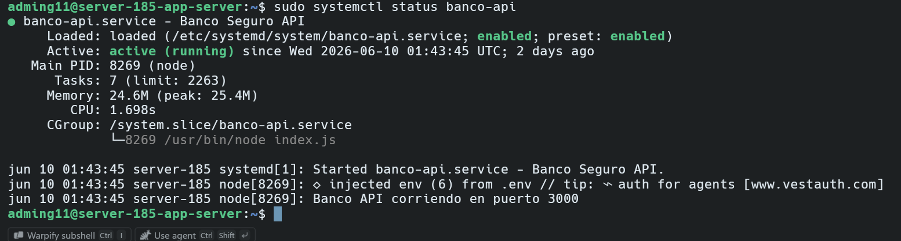
- `systemctl status banco-api` — muestra el estado actual del servicio: si está activo, el PID del proceso y las últimas líneas de log. Permite verificar que la API arrancó correctamente y se conectó a la base de datos.

### 8.8 Configuración UFW

```bash
sudo ufw default deny incoming
sudo ufw default allow outgoing
sudo ufw allow 22/tcp
sudo ufw allow from 192.168.100.184 to any port 3000
```

- `ufw allow from 192.168.100.184 to any port 3000` — permite conexiones al puerto 3000 (la API) pero solo desde la IP `192.168.100.184` (web-dmz). La opción `from <IP>` restringe por origen, añadiendo una capa de seguridad adicional más allá de las reglas iptables del router.

```bash
sudo ufw allow from 192.168.100.187 to any port 3000
```

- Permite también al cajero-terminal (.187) acceder a la API, que es la segmentación correcta: el cajero puede consultar la API pero no la base de datos directamente.

```bash
sudo ufw enable
```
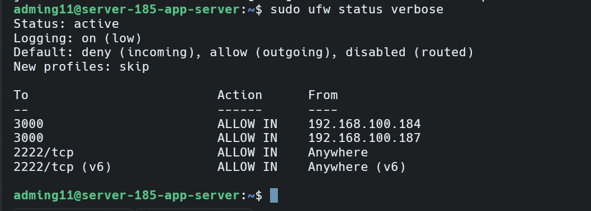
---

## 9. VM-5: db-core (192.168.100.186)

El `db-core` alberga la base de datos MariaDB del banco. Es la zona más crítica y restringida. Solo `app-server` puede conectarse directamente a la base de datos.

### 9.1 Configuración de Red (Netplan)

```bash
sudo nano /etc/netplan/50-cloud-init.yaml
```

Contenido completo del archivo:

```yaml
network:
  version: 2
  renderer: networkd
  ethernets:
    ens18:
      addresses:
        - "192.168.100.186/24"
      nameservers:
        addresses:
          - 192.168.100.183
          - 8.8.8.8
          - 8.8.4.4
        search: []
      routes:
        - to: "default"
          via: "192.168.100.182"
```
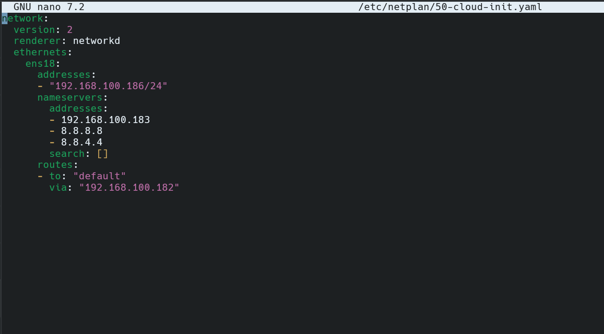
```bash
sudo netplan apply
```

### 9.2 Hostname e Instalación

```bash
sudo hostnamectl set-hostname db-core
exec bash
sudo apt update && sudo apt upgrade -y
sudo apt install -y mariadb-server ufw curl wget
```

- `mariadb-server` — instala el servidor MariaDB. MariaDB es un fork comunitario de MySQL, completamente compatible con sus comandos SQL y con mejoras en rendimiento. Es el gestor de base de datos relacional del banco.

### 9.3 Configuración DNS

```bash
sudo mkdir -p /etc/systemd/resolved.conf.d
sudo nano /etc/systemd/resolved.conf.d/bancoseguro.conf
```
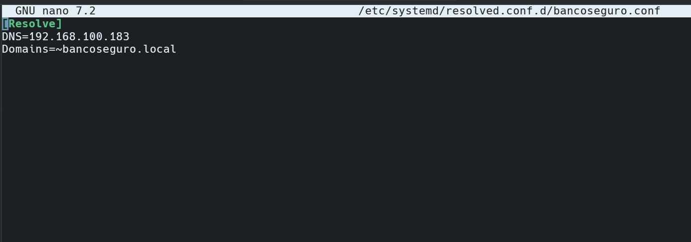
```ini
[Resolve]
DNS=192.168.100.183
Domains=~bancoseguro.local
```

```bash
sudo systemctl restart systemd-resolved
```

### 9.4 Seguridad de MariaDB

```bash
sudo mysql_secure_installation
```

- `mysql_secure_installation` — script interactivo de seguridad que guía al administrador por las configuraciones básicas de hardening de MariaDB:

| Pregunta | Respuesta | Por qué |
|----------|-----------|---------|
| Current password for root | Enter (vacío) | Sin contraseña inicial |
| Switch to unix_socket authentication | N | Necesitamos acceso por contraseña |
| Change root password | Y | Contraseña segura para root |
| Nueva contraseña | banco2026 | Contraseña del proyecto |
| Remove anonymous users | Y | Usuarios anónimos son riesgo |
| Disallow root login remotely | Y | root solo local |
| Remove test database | Y | La BD test es accesible por defecto |
| Reload privilege tables | Y | Aplicar cambios inmediatamente |

### 9.5 Configuración para Conexiones Remotas

```bash
sudo nano /etc/mysql/mariadb.conf.d/50-server.cnf
```

- `/etc/mysql/mariadb.conf.d/50-server.cnf` — archivo de configuración principal del servidor MariaDB. Los archivos en este directorio se cargan en orden numérico al iniciar.

Cambiamos la línea:

```
# Antes: solo acepta conexiones locales
bind-address = 127.0.0.1

# Después: acepta conexiones de cualquier IP
bind-address = 0.0.0.0
```
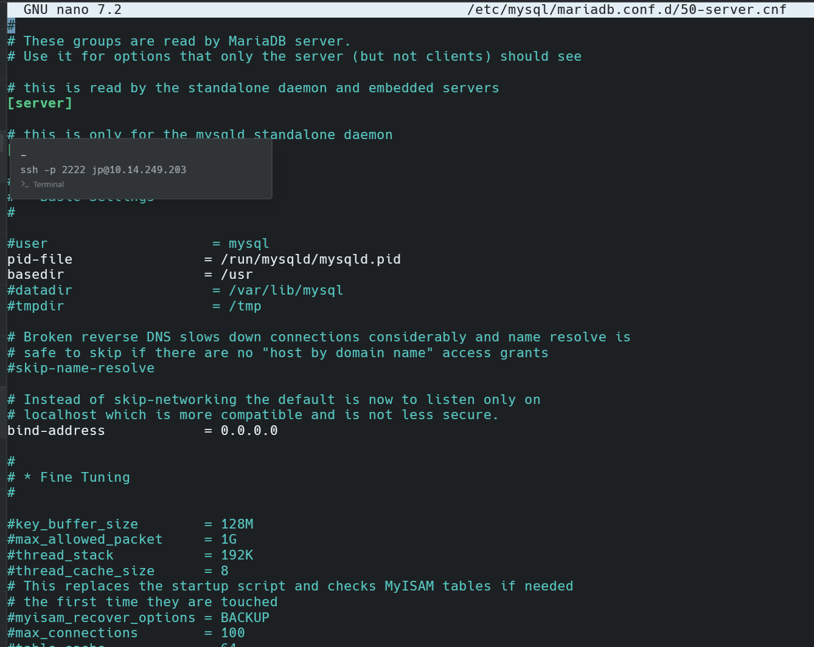
- `bind-address = 127.0.0.1` — valor por defecto que hace que MariaDB solo acepte conexiones desde el mismo servidor (localhost). App-server no podría conectarse con esta configuración.
- `bind-address = 0.0.0.0` — MariaDB escucha en todas las interfaces de red. La seguridad no se pierde porque UFW solo permite conexiones al puerto 3306 desde la IP de app-server.

```bash
sudo systemctl restart mariadb
```

- `systemctl restart mariadb` — reinicia MariaDB aplicando el nuevo `bind-address`. Después de esto, MariaDB acepta conexiones remotas en el puerto 3306.

### 9.6 Esquema de Base de Datos

```bash
sudo mysql -u root -p
```

- `mysql` — cliente de línea de comandos de MariaDB.
- `-u root` — conecta como el usuario administrador `root`.
- `-p` — solicita la contraseña de forma interactiva (más seguro que `-pbanco2026` que la expone en el historial).

Ejecutamos el siguiente SQL completo:

```sql
-- Crear y seleccionar la base de datos del banco
CREATE DATABASE banco_db;
USE banco_db;

-- Tabla de clientes: almacena los datos personales y credenciales de los usuarios
CREATE TABLE clientes (
    id INT AUTO_INCREMENT PRIMARY KEY,
    nombre VARCHAR(100) NOT NULL,
    apellido VARCHAR(100) NOT NULL,
    email VARCHAR(100) UNIQUE NOT NULL,
    username VARCHAR(50) UNIQUE NOT NULL,
    password VARCHAR(255) NOT NULL,
    created_at TIMESTAMP DEFAULT CURRENT_TIMESTAMP
);

-- Tabla de cuentas bancarias: cada cliente puede tener múltiples cuentas
CREATE TABLE cuentas (
    id INT AUTO_INCREMENT PRIMARY KEY,
    cliente_id INT NOT NULL,
    numero_cuenta VARCHAR(20) UNIQUE NOT NULL,
    saldo DECIMAL(12,2) DEFAULT 0.00,
    tipo VARCHAR(20) DEFAULT 'ahorro',
    estado VARCHAR(20) DEFAULT 'activa',
    created_at TIMESTAMP DEFAULT CURRENT_TIMESTAMP,
    FOREIGN KEY (cliente_id) REFERENCES clientes(id)
);

-- Tabla de transacciones: registro histórico de todas las transferencias
CREATE TABLE transacciones (
    id INT AUTO_INCREMENT PRIMARY KEY,
    cuenta_origen VARCHAR(20) NOT NULL,
    cuenta_destino VARCHAR(20) NOT NULL,
    monto DECIMAL(12,2) NOT NULL,
    tipo VARCHAR(30) NOT NULL,
    descripcion VARCHAR(200),
    fecha TIMESTAMP DEFAULT CURRENT_TIMESTAMP
);

-- Tabla de sesiones activas: para seguimiento de tokens JWT activos
CREATE TABLE sesiones (
    id INT AUTO_INCREMENT PRIMARY KEY,
    cliente_id INT NOT NULL,
    token VARCHAR(255) NOT NULL,
    created_at TIMESTAMP DEFAULT CURRENT_TIMESTAMP,
    expires_at TIMESTAMP NOT NULL,
    FOREIGN KEY (cliente_id) REFERENCES clientes(id)
);

-- Datos de prueba: contraseñas hasheadas con bcrypt (todas son "password")
INSERT INTO clientes (nombre, apellido, email, username, password) VALUES
('Juan', 'Perez', 'juan.perez@bancoseguro.local', 'juan.perez',
 '$2b$10$92IXUNpkjO0rOQ5byMi.Ye4oKoEa3Ro9llC/.og/at2.uheWG/igi'),
('Maria', 'Garcia', 'maria.garcia@bancoseguro.local', 'maria.garcia',
 '$2b$10$92IXUNpkjO0rOQ5byMi.Ye4oKoEa3Ro9llC/.og/at2.uheWG/igi'),
('Carlos', 'Lopez', 'carlos.lopez@bancoseguro.local', 'carlos.lopez',
 '$2b$10$92IXUNpkjO0rOQ5byMi.Ye4oKoEa3Ro9llC/.og/at2.uheWG/igi');

-- Cuentas bancarias de prueba con saldos iniciales
INSERT INTO cuentas (cliente_id, numero_cuenta, saldo, tipo) VALUES
(1, '1001234567', 5000.00, 'ahorro'),
(2, '1009876543', 12500.00, 'ahorro'),
(3, '1005555555', 3200.00, 'corriente');

-- Transacciones históricas de prueba
INSERT INTO transacciones (cuenta_origen, cuenta_destino, monto, tipo, descripcion) VALUES
('1009876543', '1001234567', 500.00, 'transferencia', 'Pago alquiler'),
('1001234567', '1005555555', 150.00, 'transferencia', 'Pago servicio'),
('1009876543', '1005555555', 1200.00, 'deposito', 'Deposito nomina');

-- Usuario de BD con acceso restringido solo desde app-server
-- El formato 'usuario'@'IP' en MariaDB restringe el acceso por IP de origen
CREATE USER 'banco2026'@'192.168.100.185' IDENTIFIED BY 'banco2026';
GRANT ALL PRIVILEGES ON banco_db.* TO 'banco2026'@'192.168.100.185';
FLUSH PRIVILEGES;
EXIT;
```

- `CREATE DATABASE banco_db` — crea la base de datos. Una base de datos en MariaDB es un contenedor de tablas y otros objetos.
- `AUTO_INCREMENT PRIMARY KEY` — el campo `id` se incrementa automáticamente con cada inserción, garantizando un identificador único sin intervención del programador.
- `DECIMAL(12,2)` — tipo de dato para valores monetarios: hasta 12 dígitos en total con 2 decimales. Más preciso que FLOAT para dinero ya que no tiene errores de punto flotante.
- `FOREIGN KEY (cliente_id) REFERENCES clientes(id)` — clave foránea que establece una relación entre tablas. Garantiza integridad referencial: no se puede crear una cuenta sin que exista el cliente.
- `$2b$10$...` — hash bcrypt de la contraseña "password". El prefijo `$2b$10$` indica el algoritmo bcrypt y el costo de trabajo (10 rondas).
- `'banco2026'@'192.168.100.185'` — en MariaDB, un usuario se identifica por nombre Y dirección IP de origen. Este usuario solo puede conectarse desde `192.168.100.185` (app-server). Si alguien intenta conectarse desde otra IP con las mismas credenciales, MariaDB rechaza la conexión.
- `GRANT ALL PRIVILEGES ON banco_db.*` — otorga todos los permisos sobre todas las tablas de `banco_db`. El usuario no puede acceder a otras bases de datos del servidor.
- `FLUSH PRIVILEGES` — recarga las tablas de privilegios para aplicar los cambios inmediatamente sin reiniciar MariaDB.

### 9.7 Configuración UFW

```bash
sudo ufw default deny incoming
sudo ufw default allow outgoing
sudo ufw allow 22/tcp
sudo ufw allow from 192.168.100.185 to any port 3306
sudo ufw enable
```
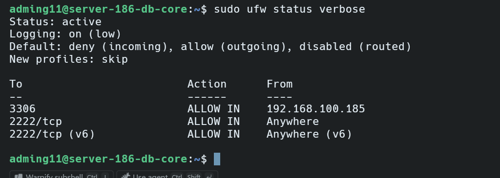
- `ufw allow from 192.168.100.185 to any port 3306` — permite conexiones al puerto 3306 (MariaDB) únicamente desde la IP de app-server. Cualquier otro intento de conexión a MariaDB desde cualquier otra IP es bloqueado.

### 9.8 Bloqueo ICMP desde cajero

```bash
sudo nano /etc/ufw/before.rules
```
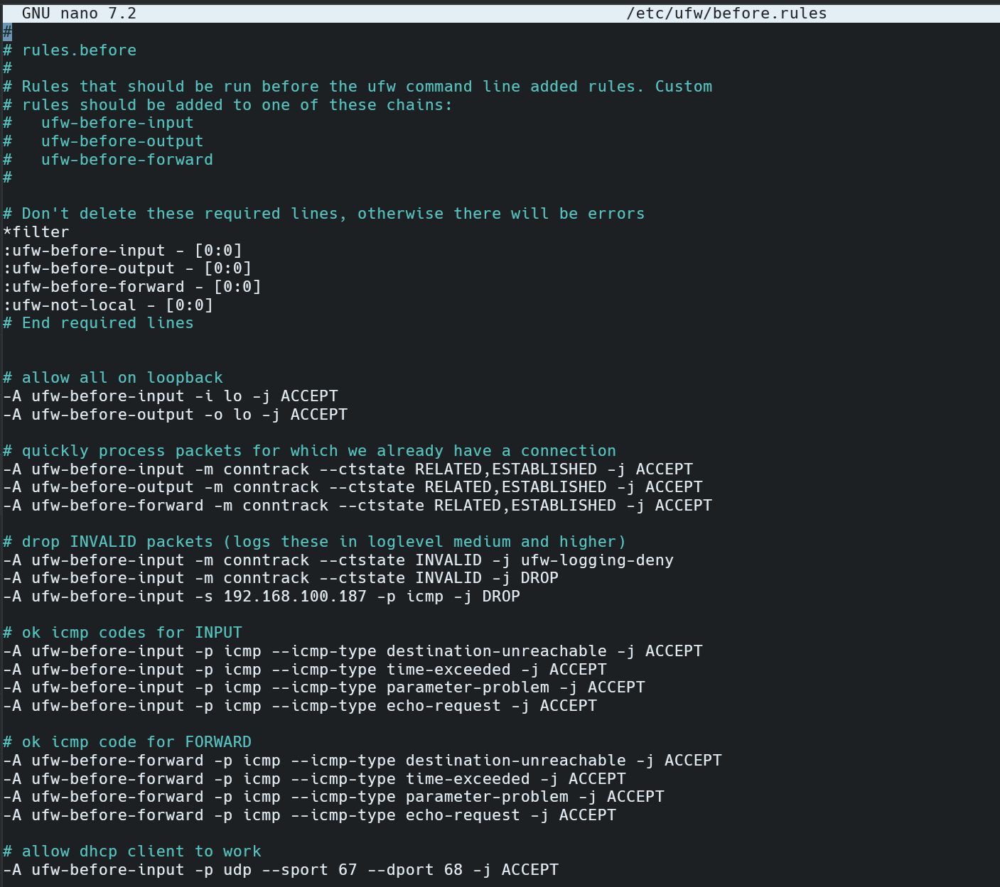
Agregar antes de `# ok icmp codes for INPUT`:

```
-A ufw-before-input -s 192.168.100.187 -p icmp -j DROP
```

```bash
sudo ufw reload
```

### 9.9 Configuración rsyslog

```bash
sudo nano /etc/rsyslog.d/50-remote.conf
```
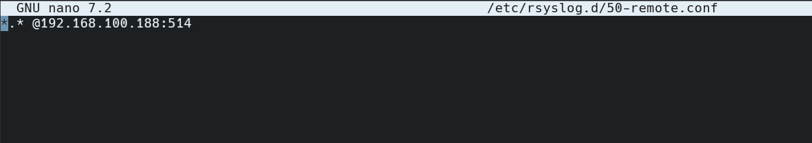
```
*.* @192.168.100.188:514
```

```bash
sudo systemctl restart rsyslog
```

---

## 10. VM-6: cajero-terminal (192.168.100.187)

### 10.1 Configuración de Red (Netplan)

```bash
sudo nano /etc/netplan/50-cloud-init.yaml
```

Contenido completo del archivo:

```yaml
network:
  version: 2
  renderer: networkd
  ethernets:
    ens18:
      addresses:
        - "192.168.100.187/24"
      nameservers:
        addresses:
          - 192.168.100.183
          - 8.8.8.8
          - 8.8.4.4
        search: []
      routes:
        - to: "default"
          via: "192.168.100.182"
```
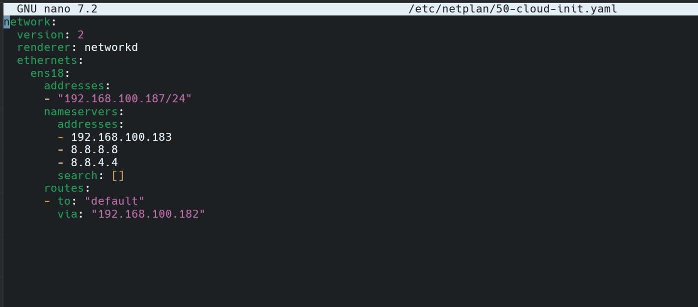
```bash
sudo netplan apply
```

### 10.2 Hostname, Instalación y Configuración

```bash
sudo hostnamectl set-hostname cajero-terminal
exec bash
sudo apt update && sudo apt upgrade -y
sudo apt install -y curl wget ufw mariadb-client
```

- `mariadb-client` — instala el cliente de línea de comandos de MariaDB. Se usa para intentar conexiones directas a db-core y verificar que están bloqueadas por las reglas de segmentación.

```bash
sudo mkdir -p /etc/systemd/resolved.conf.d
sudo nano /etc/systemd/resolved.conf.d/bancoseguro.conf
```
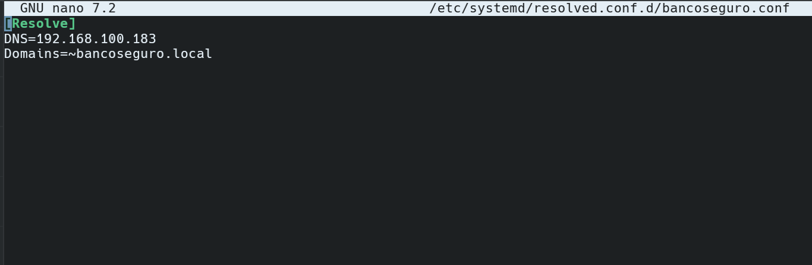
```ini
[Resolve]
DNS=192.168.100.183
Domains=~bancoseguro.local
```

```bash
sudo systemctl restart systemd-resolved
```

### 10.3 Configuración UFW y rsyslog

```bash
sudo ufw default deny incoming
sudo ufw default allow outgoing
sudo ufw allow 22/tcp
sudo ufw enable

sudo nano /etc/rsyslog.d/50-remote.conf
```
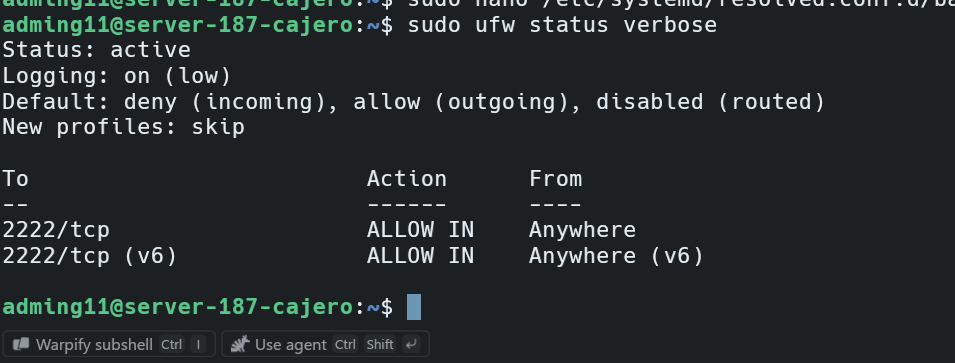
```
*.* @192.168.100.188:514
```
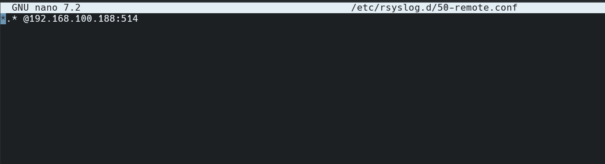
```bash
sudo systemctl restart rsyslog
```

### 10.4 Pruebas de Conectividad

```bash
# Probar que el cajero puede consultar la API (DEBE FUNCIONAR)
curl http://app-server.bancoseguro.local:3000
```

- `curl http://app-server.bancoseguro.local:3000` — hace una petición HTTP GET al endpoint raíz de la API. Si la segmentación y el DNS funcionan correctamente, debe responder `{"servicio":"Banco Seguro API","version":"1.0","estado":"activo"}`.

```bash
# Probar login vía portal web (DEBE FUNCIONAR)
curl -k -X POST https://web-dmz.bancoseguro.local/api/login \
  -H "Content-Type: application/json" \
  -d '{"username":"juan.perez","password":"password"}'
```
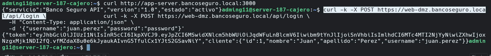
- `-k` — ignora errores de certificado SSL (necesario porque usamos certificado autofirmado).
- `-X POST` — especifica el método HTTP POST.
- `-H "Content-Type: application/json"` — establece el encabezado que indica que el body es JSON.
- `-d '{"username":"juan.perez","password":"password"}'` — datos del body en formato JSON.

```bash
# Intentar acceso directo a la BD (DEBE FALLAR)
mysql -h db-core.bancoseguro.local -u banco2026 -p banco_db
# Resultado esperado: ERROR 2002 (HY000): Can't connect - Connection timed out
```
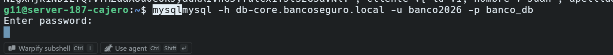

- `mysql -h db-core.bancoseguro.local` — intenta conectarse a MariaDB en db-core. Las reglas iptables en el router-fw bloquean esta conexión, y UFW en db-core también la bloquearía.

```bash
# Verificar que no hay ping a db-core (DEBE FALLAR)
ping -c 3 192.168.100.186
# Resultado esperado: 100% packet loss
```

```bash
# Verificar que no hay ping a web-dmz (DEBE FALLAR)
ping -c 3 192.168.100.184
# Resultado esperado: 100% packet loss
```
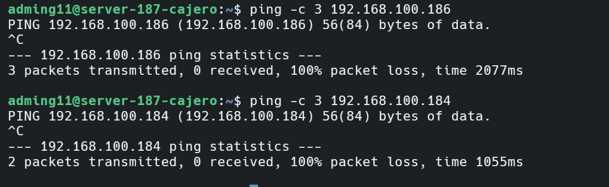
---

## 11. VM-7: siem-audit (192.168.100.188)

El `siem-audit` es el servidor centralizado de seguridad. Recibe logs de todas las VMs vía rsyslog, ejecuta Fail2ban para detectar ataques en los logs remotos y genera reportes de auditoría automáticos.

### 11.1 Configuración de Red (Netplan)

```bash
sudo nano /etc/netplan/50-cloud-init.yaml
```

Contenido completo del archivo:

```yaml
network:
  version: 2
  renderer: networkd
  ethernets:
    ens18:
      addresses:
        - "192.168.100.188/24"
      nameservers:
        addresses:
          - 192.168.100.183
          - 8.8.8.8
          - 8.8.4.4
        search: []
      routes:
        - to: "default"
          via: "192.168.100.182"
```
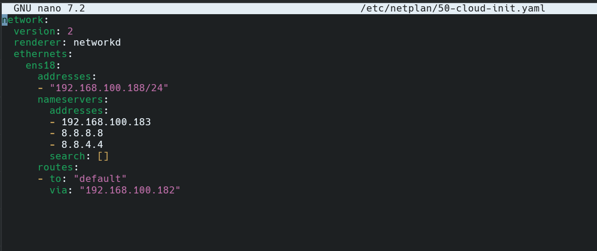

```bash
sudo netplan apply
```

### 11.2 Hostname, Instalación y Configuración DNS

```bash
sudo hostnamectl set-hostname siem-audit
exec bash
sudo apt update && sudo apt upgrade -y
sudo apt install -y rsyslog fail2ban ufw curl wget
```

```bash
sudo mkdir -p /etc/systemd/resolved.conf.d
sudo nano /etc/systemd/resolved.conf.d/bancoseguro.conf
```
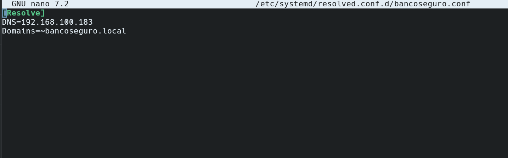
```ini
[Resolve]
DNS=192.168.100.183
Domains=~bancoseguro.local
```

```bash
sudo systemctl restart systemd-resolved
```

### 11.3 Configuración rsyslog como Servidor Central

```bash
sudo nano /etc/rsyslog.conf
```

- `/etc/rsyslog.conf` — archivo de configuración principal de rsyslog. Descomentamos las directivas para que actúe como servidor receptor de logs remotos.

Buscamos y descomentamos:

```
# Módulo para recibir logs por UDP (rápido, sin garantía de entrega)
module(load="imudp")
input(type="imudp" port="514")

# Módulo para recibir logs por TCP (más lento, con garantía de entrega)
module(load="imtcp")
input(type="imtcp" port="514")
```
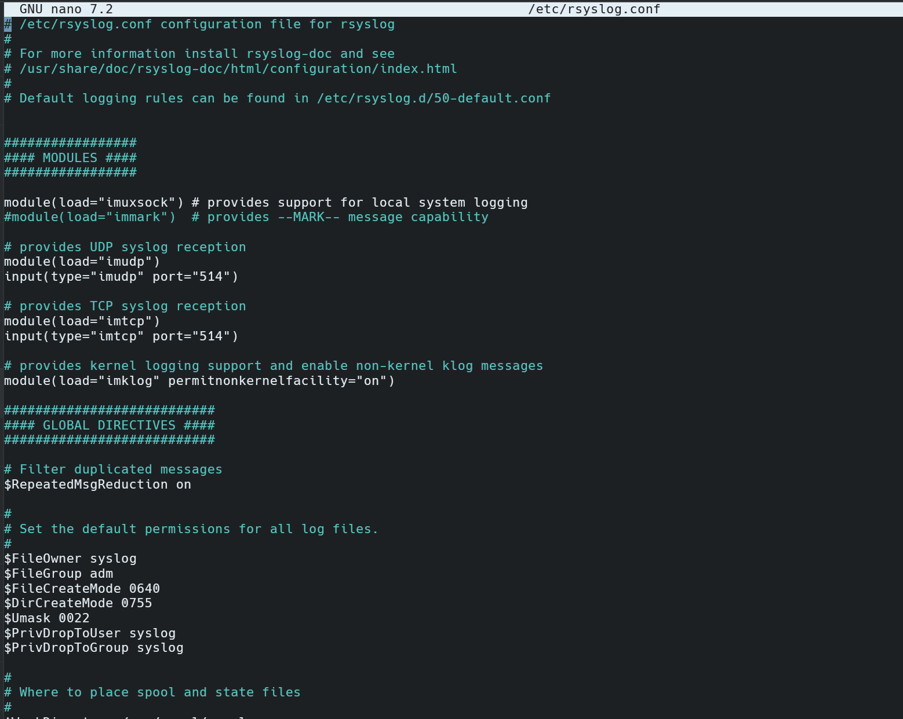
- `module(load="imudp")` — carga el módulo de entrada UDP de rsyslog. Sin este módulo, rsyslog no puede recibir logs por UDP.
- `input(type="imudp" port="514")` — configura el módulo para escuchar en el puerto 514 UDP.
- `module(load="imtcp")` y `input(type="imtcp" port="514")` — igual pero para TCP.
- Puerto 514 — puerto estándar de syslog definido en el RFC 3164.

```bash
sudo nano /etc/rsyslog.d/10-banco.conf
```
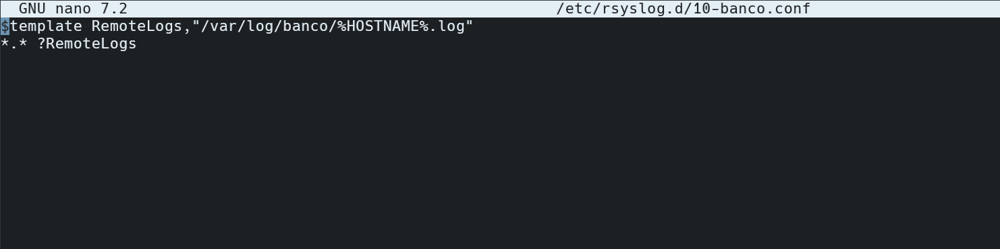
Contenido completo del archivo:

```
$template RemoteLogs,"/var/log/banco/%HOSTNAME%.log"
*.* ?RemoteLogs
```

- `$template RemoteLogs,"..."` — define una plantilla llamada `RemoteLogs` que especifica la ruta y nombre del archivo de log. `%HOSTNAME%` es una variable que rsyslog reemplaza con el hostname de la VM que envió el log.
- `*.* ?RemoteLogs` — aplica la plantilla `RemoteLogs` a todos los logs recibidos (`*.*`). El `?` indica que se usa una plantilla dinámica. Resultado: cada VM tiene su archivo de log separado en `/var/log/banco/server-182.log`, `server-183.log`, etc.

```bash
sudo mkdir -p /var/log/banco
```

- Crea el directorio donde se guardarán los logs de todas las VMs. rsyslog no lo crea automáticamente.

```bash
sudo chown syslog:adm /var/log/banco
```

- `chown syslog:adm` — establece el propietario en `syslog` (el usuario bajo el que corre rsyslog) y el grupo en `adm` (grupo de administración con acceso a logs). Sin esto, rsyslog no podría crear archivos en este directorio.

```bash
sudo systemctl restart rsyslog
```

### 11.4 Configuración de Fail2ban

```bash
sudo nano /etc/fail2ban/jail.local
```
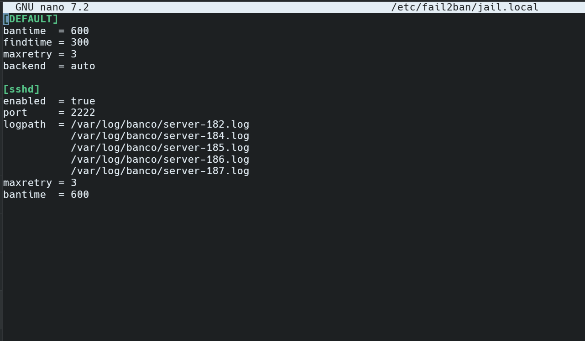
Contenido completo del archivo:

```ini
[DEFAULT]
bantime  = 600
findtime = 300
maxretry = 3
backend  = auto

[sshd]
enabled  = true
port     = 22,2222
logpath  = /var/log/banco/server-182.log
           /var/log/banco/server-184.log
           /var/log/banco/server-185.log
           /var/log/banco/server-186.log
           /var/log/banco/server-187.log
maxretry = 3
bantime  = 600
```

- `backend = auto` — Fail2ban detecta automáticamente el mejor backend de lectura de logs (systemd, polling, etc.).
- `port = 22,2222` — monitorea intentos en ambos puertos SSH (22 en router-fw, 2222 en las demás).
- `logpath` — lista de archivos de log a monitorear. Fail2ban analiza cada uno buscando patrones de ataque SSH (líneas con `Failed password`, `Invalid user`, etc.). Al detectar 3 fallos en 5 minutos, banea la IP.

```bash
sudo systemctl enable fail2ban
sudo systemctl start fail2ban
sudo fail2ban-client status sshd
```

### 11.5 Configuración UFW

```bash
sudo ufw default deny incoming
sudo ufw default allow outgoing
sudo ufw allow 22/tcp
sudo ufw allow 514/udp
sudo ufw allow 514/tcp
sudo ufw enable
```
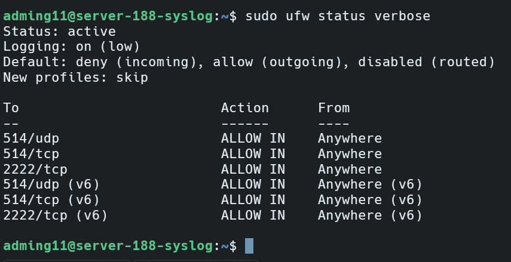
- `ufw allow 514/udp` — permite recibir logs por UDP desde todas las VMs.
- `ufw allow 514/tcp` — permite recibir logs por TCP desde todas las VMs.

---

## 12. VM-8: attacker (192.168.100.189)

### 12.1 Configuración de Red (Netplan)

```bash
sudo nano /etc/netplan/50-cloud-init.yaml
```

Contenido completo del archivo:

```yaml
network:
  version: 2
  renderer: networkd
  ethernets:
    ens18:
      addresses:
        - "192.168.100.189/24"
      nameservers:
        addresses:
          - 192.168.100.183
          - 8.8.8.8
          - 8.8.4.4
        search: []
      routes:
        - to: "default"
          via: "192.168.100.182"
```
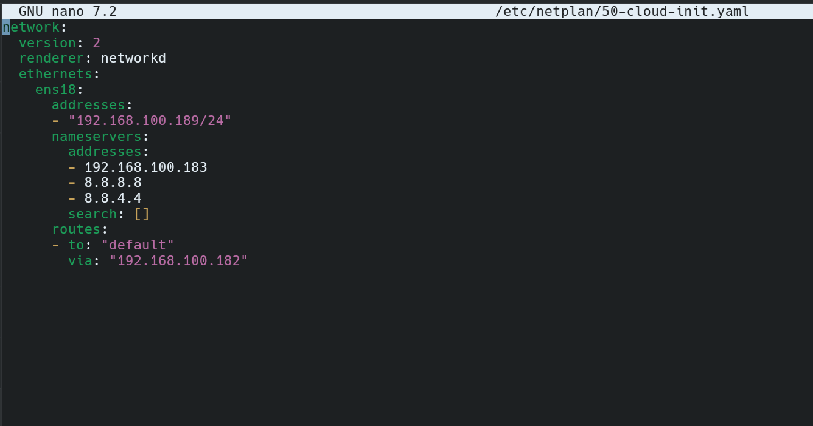
```bash
sudo netplan apply
```

### 12.2 Hostname, Instalación y Configuración

```bash
sudo hostnamectl set-hostname attacker
exec bash
sudo apt update && sudo apt upgrade -y
sudo apt install -y hydra nmap curl wget ufw mariadb-client
```

- `hydra` — herramienta de fuerza bruta para múltiples protocolos (SSH, HTTP, FTP, etc.). Puede probar miles de contraseñas por segundo contra servicios de autenticación.
- `nmap` — escáner de red para descubrir hosts activos, puertos abiertos y servicios en ejecución.

```bash
sudo mkdir -p /etc/systemd/resolved.conf.d
sudo nano /etc/systemd/resolved.conf.d/bancoseguro.conf
```
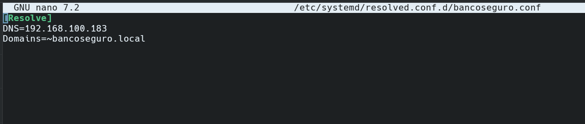
```ini
[Resolve]
DNS=192.168.100.183
Domains=~bancoseguro.local
```

```bash
sudo systemctl restart systemd-resolved
```

### 12.3 Configuración UFW y rsyslog

```bash
sudo ufw default deny incoming
sudo ufw default allow outgoing
sudo ufw allow 22/tcp
sudo ufw enable

sudo nano /etc/rsyslog.d/50-remote.conf
```
alt text
```
*.* @192.168.100.188:514
```

```bash
sudo systemctl restart rsyslog
```

### 12.4 Diccionario de Contraseñas

```bash
nano ~/passwords.txt
```
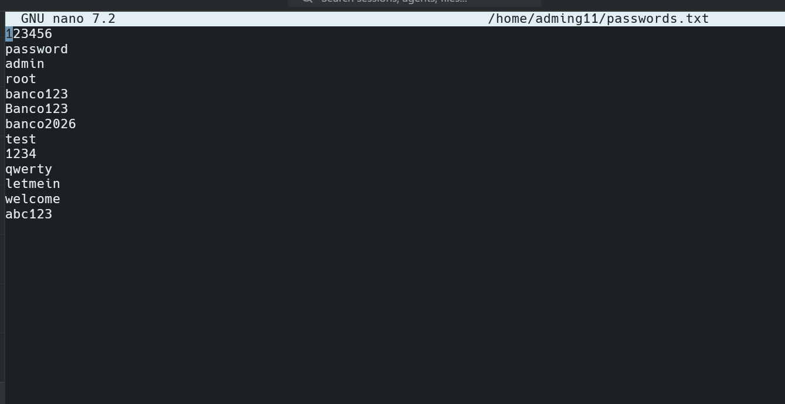
Contenido completo del archivo:

```
123456
password
admin
root
banco123
Banco123
banco2026
test
1234
qwerty
letmein
welcome
abc123
adming11
```

- Este archivo contiene contraseñas comunes que Hydra probará secuencialmente contra el servicio SSH del router-fw. La contraseña real (`banco2026`) está incluida para que el ataque "tenga éxito" en términos de probar el sistema, pero el objetivo real es demostrar que Fail2ban banea la IP antes de que Hydra la encuentre.

---

## 13. Hardening SSH en Todas las VMs

Solo el `router-fw` mantiene SSH con contraseña para acceso del docente. Todas las demás VMs usan solo claves criptográficas ed25519 y son accesibles únicamente desde el router-fw.

### 13.1 Generación de Claves en router-fw

```bash
ssh-keygen -t ed25519 -C "bancoseguro-router"
```

- `ssh-keygen` — herramienta para generar, gestionar y convertir claves SSH.
- `-t ed25519` — especifica el tipo de clave. Ed25519 usa curvas elípticas (algoritmo de Edwards), es más seguro que RSA de 2048 bits y genera claves más pequeñas y rápidas.
- `-C "bancoseguro-router"` — comentario identificador que aparece al final de la clave pública. Ayuda a identificar de dónde proviene la clave.
- Al ejecutar: Enter para guardar en `~/.ssh/id_ed25519`, Enter dos veces para sin passphrase (permite SSH automático desde scripts).

Resultado: se crean dos archivos:
- `~/.ssh/id_ed25519` — clave **privada** (nunca compartir)
- `~/.ssh/id_ed25519.pub` — clave **pública** (se copia a las VMs)

### 13.2 Distribución de Claves a Cada VM

Desde el `router-fw`:

```bash
ssh-copy-id -i ~/.ssh/id_ed25519.pub adming11@192.168.100.184
ssh-copy-id -i ~/.ssh/id_ed25519.pub adming11@192.168.100.183
ssh-copy-id -i ~/.ssh/id_ed25519.pub adming11@192.168.100.185
ssh-copy-id -i ~/.ssh/id_ed25519.pub adming11@192.168.100.186
ssh-copy-id -i ~/.ssh/id_ed25519.pub adming11@192.168.100.187
ssh-copy-id -i ~/.ssh/id_ed25519.pub adming11@192.168.100.188
ssh-copy-id -i ~/.ssh/id_ed25519.pub adming11@192.168.100.189
```

- `ssh-copy-id` — copia la clave pública SSH al archivo `~/.ssh/authorized_keys` de la VM destino de forma segura.
- `-i ~/.ssh/id_ed25519.pub` — especifica la clave pública a copiar.
- `adming11@192.168.100.184` — usuario y dirección de la VM destino. Pedirá la contraseña de `adming11` una última vez (la del sistema, no SSH key).
- Después de este comando, el router-fw puede hacer SSH a la VM sin contraseña usando la clave privada.

### 13.3 Editar sshd_config en cada VM (excepto router-fw)

```bash
sudo nano /etc/ssh/sshd_config
```
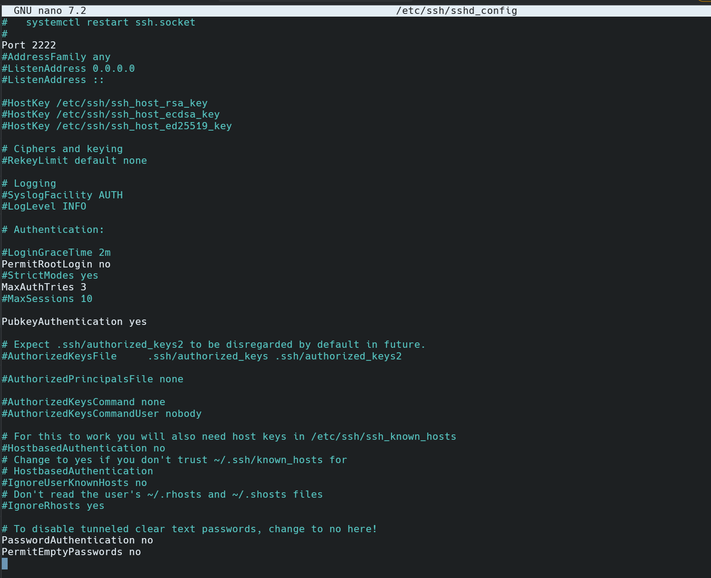
- `/etc/ssh/sshd_config` — archivo de configuración del demonio SSH (servidor SSH). Define cómo acepta conexiones el servidor.

Modificamos las siguientes líneas:

```
Port 2222
PermitRootLogin no
PasswordAuthentication no
PubkeyAuthentication yes
MaxAuthTries 3
PermitEmptyPasswords no
ClientAliveInterval 300
ClientAliveCountMax 2
```

- `Port 2222` — cambia el puerto SSH del estándar 22 al 2222. Los ataques automáticos (bots) escanean el puerto 22 masivamente. Usar un puerto no estándar reduce el ruido de ataques automáticos aunque no es una medida de seguridad definitiva.
- `PermitRootLogin no` — el usuario `root` no puede conectarse por SSH directamente. Elimina el blanco más atractivo para atacantes. Para hacer tareas administrativas se usa `sudo`.
- `PasswordAuthentication no` — deshabilita completamente la autenticación por contraseña. Solo se puede entrar con clave SSH. Hace que Hydra y otros ataques de fuerza bruta sean inútiles.
- `PubkeyAuthentication yes` — habilita explícitamente la autenticación por clave pública (ed25519).
- `MaxAuthTries 3` — cierra la conexión SSH si hay más de 3 intentos de autenticación fallidos. Dificulta ataques incluso si alguien encuentra el puerto.
- `PermitEmptyPasswords no` — prohíbe cuentas sin contraseña, por si algún usuario local no tuviera contraseña configurada.
- `ClientAliveInterval 300` — envía un paquete de "keep-alive" al cliente cada 300 segundos (5 minutos) para detectar conexiones muertas (sesiones que se cortaron sin cerrarse correctamente).
- `ClientAliveCountMax 2` — si el cliente no responde a 2 paquetes keep-alive consecutivos, cierra la sesión. Libera recursos de conexiones zombi.

### 13.4 Editar 50-cloud-init.conf

Ubuntu 24.04 tiene un archivo que sobreescribe `sshd_config`:

```bash
sudo nano /etc/ssh/sshd_config.d/50-cloud-init.conf
```
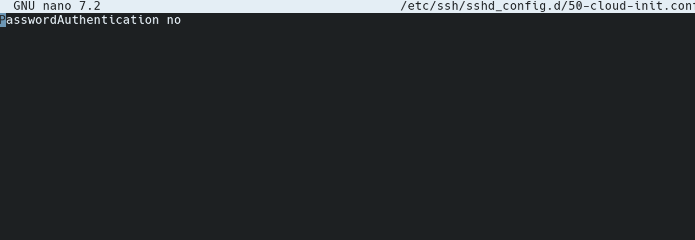
- `/etc/ssh/sshd_config.d/` — directorio de archivos de configuración adicionales de SSH. Los archivos aquí son cargados **después** y tienen prioridad sobre `sshd_config`, sobreescribiendo sus valores. Ubuntu 24.04 coloca aquí `50-cloud-init.conf` con `PasswordAuthentication yes` que contradice nuestra configuración.

Contenido completo del archivo:

```
PasswordAuthentication no
Port 2222
PermitRootLogin no
MaxAuthTries 3
```

- Repetimos aquí las directivas clave para garantizar que sobreescriben cualquier valor previo. Si este archivo dice `PasswordAuthentication yes`, la contraseña seguiría funcionando aunque `sshd_config` diga `no`.

### 13.5 Desactivar ssh.socket y Reiniciar SSH

```bash
sudo systemctl stop ssh.socket
```

- `systemctl stop ssh.socket` — detiene el socket de activación de SSH. En Ubuntu 24.04, `ssh.socket` intercepta conexiones en el puerto 22 antes que el servicio SSH, ignorando el parámetro `Port` de la configuración.

```bash
sudo systemctl disable ssh.socket
```

- `systemctl disable ssh.socket` — evita que `ssh.socket` se active automáticamente al reiniciar. Sin deshabilitar esto, el puerto 22 seguiría abierto aunque hayamos configurado el 2222.

```bash
sudo systemctl restart ssh
```

- `systemctl restart ssh` — reinicia el servicio SSH aplicando toda la nueva configuración (puerto 2222, sin contraseña, etc.).

```bash
sudo systemctl enable ssh
```

- `systemctl enable ssh` — asegura que el servicio SSH (no el socket) se active automáticamente al arrancar.

```bash
sudo ss -tlnp | grep ssh
```
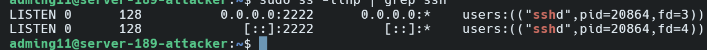
- `ss` — herramienta para mostrar estadísticas de sockets de red (reemplaza a `netstat`).
- `-t` — muestra solo sockets TCP.
- `-l` — muestra solo sockets en estado LISTEN (escuchando conexiones).
- `-n` — muestra números de puerto en lugar de nombres de servicio.
- `-p` — muestra el proceso que usa cada socket.
- `| grep ssh` — filtra la salida mostrando solo las líneas relacionadas con SSH.
- Resultado esperado: debe mostrar `0.0.0.0:2222` confirmando que SSH escucha en el puerto correcto.

### 13.6 Actualizar UFW en cada VM

```bash
sudo ufw allow 2222/tcp
```

- Agrega una regla que permite SSH entrante en el nuevo puerto 2222.

```bash
sudo ufw delete allow 22/tcp
```

- `ufw delete allow 22/tcp` — elimina la regla que permitía SSH en el puerto 22. Sin esto, aunque SSH ya no escuche en el 22, la regla seguiría existiendo innecesariamente.

```bash
sudo ufw reload
```

- `ufw reload` — aplica los cambios en las reglas de UFW sin deshabilitar el firewall.


### 13.7 Verificar acceso desde router-fw

```bash
ssh -i ~/.ssh/id_ed25519 -p 2222 adming11@192.168.100.184
```
```bash
ssh -p 2222 adming11@192.168.100.184
```

- `-i ~/.ssh/id_ed25519` — especifica la clave privada a usar para autenticación.
- `-p 2222` — conecta al puerto 2222 en lugar del 22.
- Debe conectar sin pedir contraseña (usando la clave) directamente.

---

## 14. Segmentación con iptables en router-fw

### 14.1 Reglas de Segmentación Bancaria

```bash
# DNS (.183): todas las VMs pueden consultar DNS
sudo iptables -A FORWARD -d 192.168.100.183 -p udp --dport 53 -j ACCEPT
sudo iptables -A FORWARD -d 192.168.100.183 -p tcp --dport 53 -j ACCEPT
```

- `-d 192.168.100.183` — coincide con paquetes destinados al dns-server.
- `--dport 53` — puerto DNS. Todas las VMs necesitan poder consultar el DNS interno.

```bash
# Cajero → app-server: PERMITIDO (para consultar la API bancaria)
sudo iptables -A FORWARD -s 192.168.100.187 -d 192.168.100.185 -j ACCEPT
```

- `-s 192.168.100.187` — origen: cajero-terminal.
- `-d 192.168.100.185` — destino: app-server.
- Un cajero bancario real necesita poder consultar saldos y realizar operaciones a través de la API.

```bash
# Cajero → db-core: BLOQUEADO (acceso directo a BD no permitido)
sudo iptables -A FORWARD -s 192.168.100.187 -d 192.168.100.186 -j DROP
```

- Un cajero nunca debería acceder directamente a la base de datos, solo a través de la API.

```bash
# Cajero → web-dmz: BLOQUEADO (cajero no necesita acceder al portal web)
sudo iptables -A FORWARD -s 192.168.100.187 -d 192.168.100.184 -j DROP
```

```bash
# web-dmz → app-server: PERMITIDO (Nginx reenvía peticiones /api/ al backend)
sudo iptables -A FORWARD -s 192.168.100.184 -d 192.168.100.185 -j ACCEPT
```

- El proxy inverso de Nginx en web-dmz necesita poder llegar a la API en app-server.

```bash
# web-dmz → db-core: BLOQUEADO (web nunca accede directo a la BD)
sudo iptables -A FORWARD -s 192.168.100.184 -d 192.168.100.186 -j DROP
```

```bash
# app-server → db-core: PERMITIDO solo puerto 3306 (acceso a MariaDB)
sudo iptables -A FORWARD -s 192.168.100.185 -d 192.168.100.186 -p tcp --dport 3306 -j ACCEPT
```

- `-p tcp --dport 3306` — solo tráfico TCP al puerto 3306 (MariaDB). app-server es el único autorizado a acceder a la base de datos.

```bash
# attacker → web-dmz: PERMITIDO (para simular el ataque)
sudo iptables -A FORWARD -s 192.168.100.189 -d 192.168.100.184 -j ACCEPT

# attacker → db-core: BLOQUEADO
sudo iptables -A FORWARD -s 192.168.100.189 -d 192.168.100.186 -j DROP
```

```bash
# siem-audit: recibe logs de todas las VMs (puerto 514)
sudo iptables -A FORWARD -d 192.168.100.188 -p udp --dport 514 -j ACCEPT
sudo iptables -A FORWARD -d 192.168.100.188 -p tcp --dport 514 -j ACCEPT
```

```bash
sudo netfilter-persistent save
```

- Guarda todas las reglas permanentemente para que sobrevivan reinicios.


Verificacion
```bash 
sudo iptables -L FORWARD -n -v --line-numbers
sudo iptables -t nat -L -v
```

---

## 15. Pruebas de Conectividad

### Desde cajero-terminal (.187)

```bash
# ✅ FUNCIONA — consulta API directamente
curl http://app-server.bancoseguro.local:3000
# Resultado: {"servicio":"Banco Seguro API","version":"1.0","estado":"activo"}

# ✅ FUNCIONA — login vía portal web
curl -k -X POST https://web-dmz.bancoseguro.local/api/login \
  -H "Content-Type: application/json" \
  -d '{"username":"juan.perez","password":"password"}'
# Resultado: {"token":"eyJ...","cliente":{...}}

# ❌ BLOQUEADO — acceso directo a BD
mysql -h db-core.bancoseguro.local -u banco2026 -p banco_db
# Resultado: ERROR 2002 (HY000): Can't connect (115)

# ❌ BLOQUEADO — ping a db-core
ping -c 3 192.168.100.186
# Resultado: 100% packet loss

# ❌ BLOQUEADO — ping a web-dmz
ping -c 3 192.168.100.184
# Resultado: 100% packet loss
```

### Resolución DNS desde cualquier VM

```bash
# Resolución directa
dig web-dmz.bancoseguro.local
# ANSWER: web-dmz.bancoseguro.local. 604800 IN A 192.168.100.184 ✅

# Resolución inversa
dig -x 192.168.100.184
# ANSWER: 184.100.168.192.in-addr.arpa. PTR web-dmz.bancoseguro.local. ✅

# Resolución de internet (forwarder)
dig google.com
# ANSWER: google.com. 235 IN A 142.251.x.x ✅
```
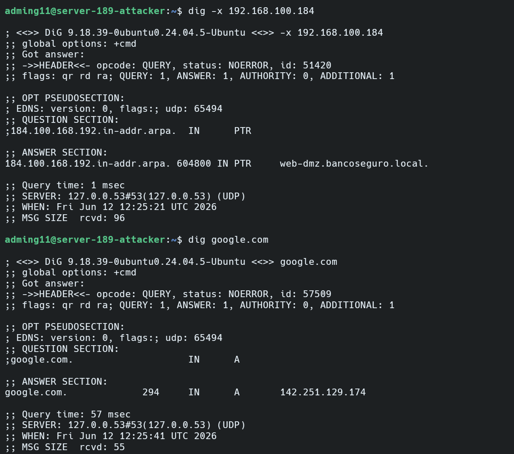
---

## 16. Simulación de Ataque

### 16.1 Escaneo de Reconocimiento (Nmap)

Desde `attacker`:

```bash
nmap -sV -p 22,2222,80,443 192.168.100.184
```
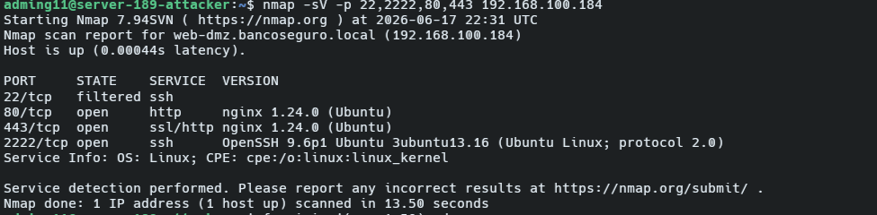
- `nmap` — escáner de red.
- `-sV` — detecta versiones de los servicios corriendo en cada puerto abierto. Hace peticiones adicionales para identificar el software y versión.
- `-p 22,2222,80,443` — solo escanea estos puertos específicos en lugar de los 65535.
- Resultado: puerto 22 filtered (UFW lo bloquea), 80 open (nginx), 443 open (nginx TLS), 2222 open (OpenSSH).

### 16.2 Reconocimiento Web

```bash
for i in $(seq 1 50); do
  curl -sk -o /dev/null -w "%{http_code}" https://192.168.100.184/admin$i
  echo " -> /admin$i"
done
```
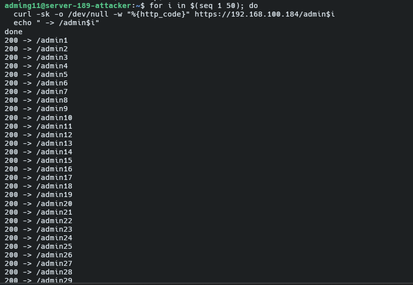
- `for i in $(seq 1 50)` — bucle que itera de 1 a 50. `seq` genera la secuencia numérica.
- `curl -sk` — `-s` silencioso (sin progreso), `-k` ignora certificado SSL.
- `-o /dev/null` — descarta el cuerpo de la respuesta, no lo muestra.
- `-w "%{http_code}"` — muestra solo el código HTTP de respuesta (200, 404, etc.).
- Todos devuelven 200 porque Nginx sirve `index.html` para rutas inexistentes (SPA).

### 16.3 Ataque de Fuerza Bruta SSH con Hydra
En siem audit ejecutar
```bash 
sudo tail -f /var/log/banco/server-182.log
```
Nos permitira monitorear el ataque 

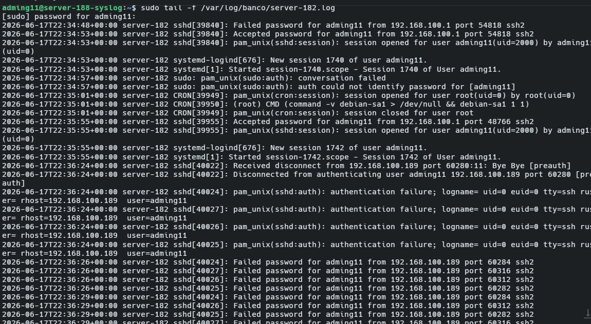

```bash
hydra -l adming11 -P ~/passwords.txt ssh://192.168.100.182 -t 4 -V
```

- `hydra` — herramienta de fuerza bruta.
- `-l adming11` — usuario objetivo (login único).
- `-P ~/passwords.txt` — archivo con la lista de contraseñas a probar.
- `ssh://192.168.100.182` — protocolo SSH y dirección objetivo (router-fw).
- `-t 4` — usa 4 hilos paralelos de ataque simultáneos.
- `-V` — modo verbose: muestra cada intento en pantalla.


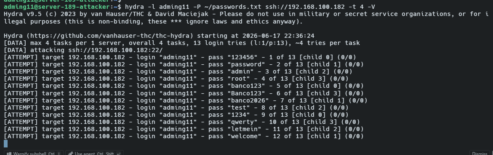
### 16.4 Respuesta de Fail2ban

Verificamos en el router-fw y siem-audit:

```bash
sudo fail2ban-client status sshd
# Resultado:
# Currently banned: 1
# Banned IP list:   192.168.100.189 ✅
```
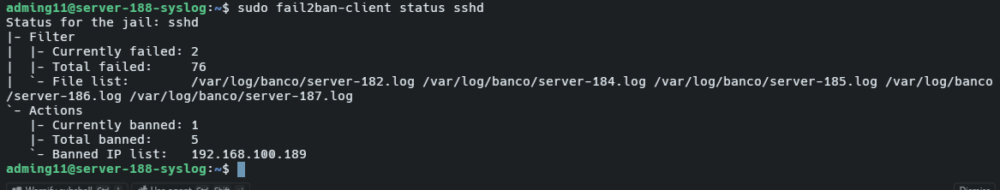
```bash
# Verificar que el atacante está bloqueado
ssh adming11@192.168.100.182  # desde attacker
# Resultado: ssh: connect to host 192.168.100.182: Connection refused ✅
```
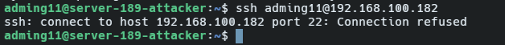
### 16.5 Desbanear IP para Repetir la Simulación

```bash
# En router-fw
sudo fail2ban-client set sshd unbanip 192.168.100.189
```

- `fail2ban-client set sshd unbanip 192.168.100.189` — elimina manualmente la IP del listado de baneados y elimina la regla iptables que bloqueaba la conexión.

```bash
# En siem-audit
sudo fail2ban-client set sshd unbanip 192.168.100.189
```

---

## 17. Backup Cifrado (VM db-core)

### 17.1 Instalación de GPG y Generación de Clave 

```bash
sudo apt install -y gpg
```

- `gpg` — GNU Privacy Guard, implementación de código abierto del estándar OpenPGP. Proporciona cifrado asimétrico (clave pública/privada) y simétrico para proteger archivos.

```bash
gpg --gen-key
```

- `gpg --gen-key` — inicia el asistente de generación de clave GPG. Pide nombre, email y passphrase.
- **Nombre:** Banco Seguro
- **Email:** backup@bancoseguro.local
- **Passphrase:** Backup$2026

```bash
gpg --export "Banco Seguro" > /tmp/bancoseguro.pub
```

- `gpg --export "Banco Seguro"` — exporta la clave pública del usuario "Banco Seguro" en formato binario a la salida estándar.
- `> /tmp/bancoseguro.pub` — redirige la salida al archivo temporal. Necesitamos exportar la clave pública para importarla al usuario root, que es quien ejecuta el script de backup.

```bash
sudo gpg --import /tmp/bancoseguro.pub
```

- `gpg --import` — importa la clave pública al keyring del usuario root. Ahora root puede cifrar archivos con la clave pública de "Banco Seguro".

```bash
sudo gpg --edit-key "Banco Seguro"
# trust → 5 → y → quit
```

- `gpg --edit-key` — abre el editor interactivo de GPG para gestionar una clave.
- `trust` — comando para establecer el nivel de confianza en la clave.
- `5` — confianza absoluta (ultimate trust). Sin esto, GPG mostraría advertencias de "no hay certeza de que esta clave pertenece al usuario" y rechazaría cifrar.
- `y` — confirmar.
- `quit` — salir del editor.


### 17.2 Script de Backup

```bash
sudo nano /usr/local/bin/backup-banco.sh
```

- `/usr/local/bin/` — directorio para scripts y binarios locales del administrador. Está en el PATH del sistema, por lo que los scripts aquí pueden ejecutarse desde cualquier directorio.

Contenido completo del archivo:

```bash
#!/bin/bash

# Variables de fecha para los nombres de archivos
FECHA=$(date '+%Y%m%d_%H%M%S')
BACKUP_DIR="/var/backups/banco"
BACKUP_FILE="$BACKUP_DIR/backup_banco_db_$FECHA.sql"
BACKUP_CIFRADO="$BACKUP_FILE.gpg"

# Crear directorio de backups si no existe
mkdir -p $BACKUP_DIR

# Exportar la base de datos completa a un archivo SQL
mysqldump -u root -pbanco2026 banco_db > $BACKUP_FILE

# Verificar que el dump fue exitoso (código de salida 0 = éxito)
if [ $? -ne 0 ]; then
    echo "ERROR: Falló el backup de la base de datos"
    exit 1
fi

# Cifrar el archivo SQL con la clave pública GPG de "Banco Seguro"
# --batch: modo no interactivo
# --yes: sobreescribir sin preguntar
# --recipient: la clave pública a usar para cifrar
# --encrypt: realizar cifrado asimétrico
gpg --batch --yes \
    --recipient "Banco Seguro" \
    --encrypt $BACKUP_FILE

# Eliminar el archivo SQL sin cifrar para que no quede expuesto
rm $BACKUP_FILE

echo "Backup cifrado generado: $BACKUP_CIFRADO"
ls -lh $BACKUP_CIFRADO
```

- `#!/bin/bash` — shebang: indica al sistema que este script debe ejecutarse con bash.
- `date '+%Y%m%d_%H%M%S'` — genera un timestamp como `20260612_013000` para nombres de archivo únicos.
- `mysqldump` — herramienta de backup de MariaDB/MySQL que exporta la estructura y datos de la base de datos en formato SQL legible.
- `-u root -pbanco2026 banco_db` — usuario, contraseña y nombre de la BD a exportar.
- `$?` — variable especial de bash que contiene el código de salida del último comando (0 = éxito, cualquier otro = error).
- `gpg --batch --yes --recipient "Banco Seguro" --encrypt` — cifra el archivo SQL con la clave pública. Solo quien tenga la clave privada y la passphrase puede descifrar.
- `rm $BACKUP_FILE` — elimina el SQL sin cifrar para que en caso de acceso no autorizado al sistema de archivos, no se pueda leer el backup directamente.

```bash
sudo chmod +x /usr/local/bin/backup-banco.sh
```

- `chmod +x` — agrega el permiso de ejecución al script. Sin esto, el sistema no lo reconoce como ejecutable y no puede correr directamente.

```bash
sudo bash /usr/local/bin/backup-banco.sh
```

- Prueba manual del script para verificar que funciona correctamente antes de automatizarlo.

### 17.3 Automatización con Crontab

```bash
sudo crontab -e
```

- `crontab -e` — abre el archivo de tareas programadas del usuario root para edición. `cron` es el programador de tareas de Linux que ejecuta comandos según un horario definido.

```
0 2 * * * /usr/local/bin/backup-banco.sh
```

- `0 2 * * *` — expresión cron: minuto 0, hora 2, cualquier día del mes, cualquier mes, cualquier día de la semana. Se ejecuta todos los días a las 2:00 AM.
- Los cinco campos son: minuto (0-59), hora (0-23), día del mes (1-31), mes (1-12), día de la semana (0-7, donde 0 y 7 son domingo).


### 17.4 Verificación del Backup Cifrado

Una vez ejecutado el script, verificamos que el archivo existe y está realmente cifrado:

```bash
ls -lh /var/backups/banco/
```
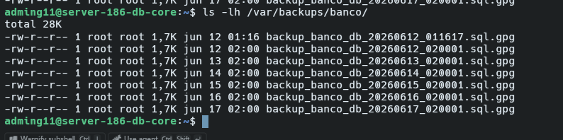
- `ls -lh` — lista los archivos del directorio en formato largo (`-l`) con tamaños legibles (`-h` human-readable, muestra KB, MB en lugar de bytes).
- Debe mostrar el archivo `backup_banco_db_FECHA.sql.gpg` confirmando que se generó correctamente.

```bash
sudo cat /var/backups/banco/backup_banco_db_*.sql.gpg
```
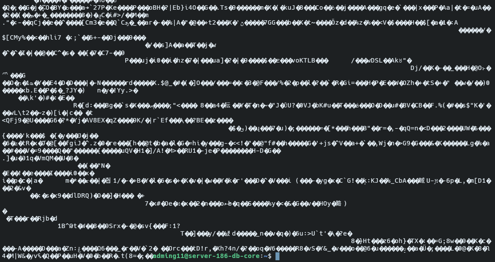
- Intenta mostrar el contenido del archivo. El resultado son caracteres completamente ilegibles (binario cifrado), confirmando que el cifrado fue aplicado correctamente. Nadie puede leer la base de datos sin la clave privada y la passphrase.

```bash
gpg --decrypt $(ls -t /var/backups/banco/*.sql.gpg | head -1)
```

- `gpg --decrypt` — descifra el archivo usando la clave privada almacenada en el keyring del usuario actual.
- `$(ls -t /var/backups/banco/*.sql.gpg | head -1)` — selecciona automáticamente el archivo más reciente. `ls -t` ordena por fecha de modificación (más reciente primero) y `head -1` toma solo el primero.
- Solicita la passphrase: `Backup$2026`
- Si el descifrado es exitoso, muestra el contenido SQL completo de la base de datos (tablas, estructura y datos) en pantalla, confirmando que el backup es íntegro y recuperable cuando sea necesario.
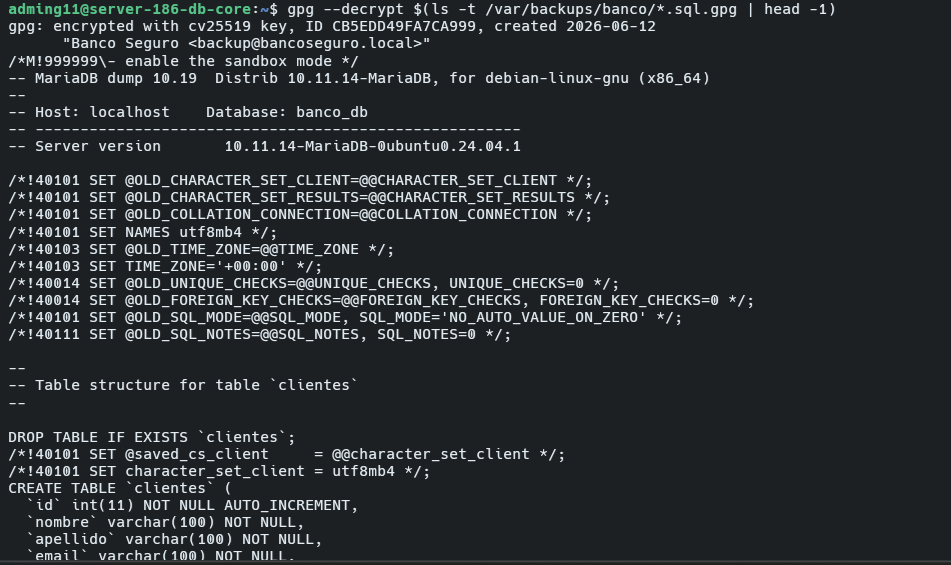

## 18. Script de Auditoría (VM sys-log)

### 18.1 Crear el Script

```bash
sudo nano /usr/local/bin/auditoria-banco.sh
```
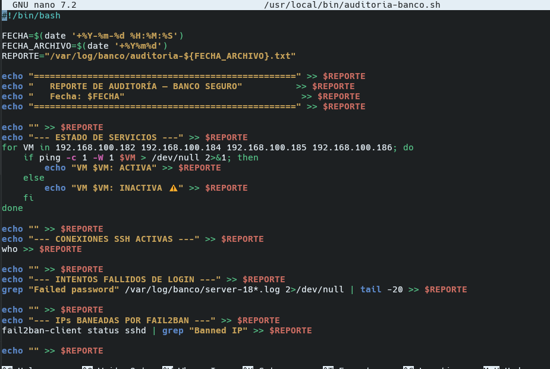
Contenido completo del archivo:

```bash
#!/bin/bash

FECHA=$(date '+%Y-%m-%d %H:%M:%S')
FECHA_ARCHIVO=$(date '+%Y%m%d')
REPORTE="/var/log/banco/auditoria-${FECHA_ARCHIVO}.txt"

echo "=================================================" >> $REPORTE
echo "   REPORTE DE AUDITORÍA — BANCO SEGURO"          >> $REPORTE
echo "   Fecha: $FECHA"                                 >> $REPORTE
echo "=================================================" >> $REPORTE

# Verificar conectividad con las VMs principales
echo "" >> $REPORTE
echo "--- ESTADO DE SERVICIOS ---" >> $REPORTE
for VM in 192.168.100.182 192.168.100.184 192.168.100.185 192.168.100.186; do
    if ping -c 1 -W 1 $VM > /dev/null 2>&1; then
        echo "VM $VM: ACTIVA" >> $REPORTE
    else
        echo "VM $VM: INACTIVA ⚠️" >> $REPORTE
    fi
done

# Mostrar sesiones SSH activas en el servidor
echo "" >> $REPORTE
echo "--- CONEXIONES SSH ACTIVAS ---" >> $REPORTE
who >> $REPORTE

# Buscar intentos fallidos de login en todos los logs remotos
echo "" >> $REPORTE
echo "--- INTENTOS FALLIDOS DE LOGIN ---" >> $REPORTE
grep "Failed password" /var/log/banco/server-18*.log 2>/dev/null | tail -20 >> $REPORTE

# Listar IPs actualmente baneadas por Fail2ban
echo "" >> $REPORTE
echo "--- IPs BANEADAS POR FAIL2BAN ---" >> $REPORTE
fail2ban-client status sshd | grep "Banned IP" >> $REPORTE

# Mostrar tamaño y fecha de cada archivo de log por VM
echo "" >> $REPORTE
echo "--- LOGS RECIBIDOS POR VM ---" >> $REPORTE
ls -lh /var/log/banco/*.log >> $REPORTE

# Estado del firewall de esta VM
echo "" >> $REPORTE
echo "--- REGLAS FIREWALL ACTIVAS ---" >> $REPORTE
ufw status verbose >> $REPORTE

echo "" >> $REPORTE
echo "=================================================" >> $REPORTE
echo "   FIN DEL REPORTE"                               >> $REPORTE
echo "=================================================" >> $REPORTE

echo "Reporte generado: $REPORTE"

# ── DETECCIÓN AUTOMÁTICA DE INCIDENTES ──────────────────────
# Si hubo intentos fallidos O hay IPs baneadas, genera documento de incidente
TOTAL_FAILED=$(fail2ban-client status sshd | grep "Total failed" | awk '{print $NF}')
BANEADAS=$(fail2ban-client status sshd | grep "Banned IP" | awk -F: '{print $2}')

if [ "$TOTAL_FAILED" -gt "0" ] || [ ! -z "$BANEADAS" ]; then
    INCIDENTE="/var/log/banco/incidente-$(date '+%Y%m%d_%H%M%S').txt"

    echo "=================================================" >> $INCIDENTE
    echo "   REPORTE DE INCIDENTE DE SEGURIDAD"             >> $INCIDENTE
    echo "   Fecha: $FECHA"                                  >> $INCIDENTE
    echo "=================================================" >> $INCIDENTE

    echo "" >> $INCIDENTE
    echo "--- FASE 1: PREPARACIÓN ---"                       >> $INCIDENTE
    echo "Sistema: Infraestructura Bancaria Simulada"        >> $INCIDENTE
    echo "Medidas activas: UFW, Fail2ban, Hardening SSH, Logs centralizados" >> $INCIDENTE

    echo "" >> $INCIDENTE
    echo "--- FASE 2: IDENTIFICACIÓN ---"                    >> $INCIDENTE
    echo "Total intentos fallidos: $TOTAL_FAILED"            >> $INCIDENTE
    echo "IPs baneadas actualmente: $BANEADAS"               >> $INCIDENTE
    echo "" >> $INCIDENTE
    echo "Últimos eventos de ataque:"                        >> $INCIDENTE
    grep "Failed password\|UFW BLOCK\|authentication failure" \
        /var/log/banco/server-182.log 2>/dev/null | tail -10 >> $INCIDENTE

    echo "" >> $INCIDENTE
    echo "--- FASE 3: CONTENCIÓN ---"                        >> $INCIDENTE
    echo "Acción automática Fail2ban:"                       >> $INCIDENTE
    fail2ban-client status sshd                              >> $INCIDENTE
    echo "" >> $INCIDENTE
    echo "Estado del firewall:"                              >> $INCIDENTE
    ufw status verbose                                       >> $INCIDENTE

    echo "" >> $INCIDENTE
    echo "--- FASE 4: ERRADICACIÓN ---"                      >> $INCIDENTE
    echo "Logs preservados en: /var/log/banco/"              >> $INCIDENTE
    echo "" >> $INCIDENTE
    echo "Integridad de servicios:"                          >> $INCIDENTE
    for VM in 192.168.100.182 192.168.100.184 192.168.100.185 192.168.100.186; do
        if ping -c 1 -W 1 $VM > /dev/null 2>&1; then
            echo "VM $VM: OPERATIVA"                         >> $INCIDENTE
        else
            echo "VM $VM: NO RESPONDE ⚠️"                   >> $INCIDENTE
        fi
    done
    echo "" >> $INCIDENTE
    echo "Bloques UFW desde atacante:"                       >> $INCIDENTE
    grep "UFW BLOCK" /var/log/banco/server-182.log 2>/dev/null | tail -5 >> $INCIDENTE
    grep "UFW BLOCK" /var/log/banco/server-184.log 2>/dev/null | tail -5 >> $INCIDENTE

    echo "" >> $INCIDENTE
    echo "--- FASE 5: RECUPERACIÓN ---"                      >> $INCIDENTE
    echo "Portal bancario: https://bancoseguro.rootcode.com.bo" >> $INCIDENTE
    echo "Estado general: Sistema operativo post-incidente"  >> $INCIDENTE
    echo "" >> $INCIDENTE
    echo "Lecciones aprendidas:"                             >> $INCIDENTE
    echo "- Fail2ban bloqueó automáticamente al atacante"    >> $INCIDENTE
    echo "- Segmentación impidió acceso a zona core"         >> $INCIDENTE
    echo "- Logs centralizados permitieron detección temprana" >> $INCIDENTE
    echo "- Hardening SSH redujo superficie de ataque"       >> $INCIDENTE
    echo "" >> $INCIDENTE
    echo "Recomendaciones:"                                  >> $INCIDENTE
    echo "- Instalar Fail2ban en todas las VMs"              >> $INCIDENTE
    echo "- Agregar alertas por email ante incidentes"       >> $INCIDENTE
    echo "- Implementar IDS/IPS completo (Wazuh/Snort)"      >> $INCIDENTE

    echo "=================================================" >> $INCIDENTE
    echo "   FIN DEL REPORTE DE INCIDENTE"                  >> $INCIDENTE
    echo "=================================================" >> $INCIDENTE

    echo "⚠️  INCIDENTE DETECTADO - Reporte generado: $INCIDENTE"
fi
```

- `>>` — operador de redirección que agrega al final del archivo (en lugar de `>` que sobreescribe).
- `ping -c 1 -W 1 $VM > /dev/null 2>&1` — ping con 1 solo paquete (`-c 1`) y timeout de 1 segundo (`-W 1`). La salida y errores van a `/dev/null` (descartados) porque solo nos importa el código de salida.
- `fail2ban-client status sshd | grep "Total failed" | awk '{print $NF}'` — cadena de comandos: obtiene el estado de Fail2ban, filtra la línea con "Total failed" y extrae el último campo (el número).
- `$NF` en awk — variable especial que representa el último campo de la línea actual.
- `[ ! -z "$BANEADAS" ]` — condición bash: verdadero si la variable no está vacía (`-z` es "is empty", `!` niega).

```bash
sudo chmod +x /usr/local/bin/auditoria-banco.sh
sudo bash /usr/local/bin/auditoria-banco.sh
```
- Ejecuta el script manualmente para verificar que funciona correctamente antes de automatizarlo con crontab.

Verificamos que el reporte se generó correctamente:

```bash
cat /var/log/banco/auditoria-$(date '+%Y%m%d').txt
```

- `cat` — muestra el contenido del archivo en pantalla.
- `$(date '+%Y%m%d')` — genera la fecha actual en formato YYYYMMDD para construir el nombre exacto del archivo del día de hoy.
- El reporte debe mostrar el estado de las VMs, conexiones SSH activas, intentos fallidos de login y estado del firewall.

Verificamos si se generó algún reporte de incidente:

```bash
ls -lh /var/log/banco/incidente-*.txt 2>/dev/null
```

- Si hubo intentos fallidos detectados por Fail2ban, este comando listará los archivos de incidente generados automáticamente por el script.
- `2>/dev/null` — suprime el error en caso de que no exista ningún archivo de incidente todavía.

### 18.2 Programación del Crontab

```bash
sudo crontab -e
```

**Para presentación al docente (cada minuto):**

```
* * * * * /usr/local/bin/auditoria-banco.sh
```

**Para producción normal (cada hora):**

```
0 * * * * /usr/local/bin/auditoria-banco.sh
```

> **Nota importante:** Cambiar a `* * * * *` antes de la presentación para demostrar en tiempo real la generación de reportes. Volver a `0 * * * *` al terminar.

Verificamos que los reportes se están generando automáticamente:

```bash
ls -lh /var/log/banco/auditoria-*.txt
```

- Muestra todos los reportes de auditoría generados. Si el crontab funciona correctamente se verá un archivo por cada período configurado, confirmando que el sistema de auditoría automática está operativo.
---

## 19. Documento de Incidente — 5 Fases

### Resumen del Incidente

| Campo | Valor |
|-------|-------|
| Fecha/Hora | 2026-06-12 01:44 UTC |
| Tipo | Escaneo nmap + Fuerza bruta SSH (Hydra) + Reconocimiento web |
| IP atacante | 192.168.100.189 (attacker) |
| Objetivo | router-fw (.182) y web-dmz (.184) |
| Impacto | Ninguno — contenido automáticamente |
| Tiempo de respuesta | < 5 minutos (automático por Fail2ban) |

### Fase 1 — Preparación
Medidas preventivas activas antes del incidente: segmentación iptables, UFW en todas las VMs, hardening SSH, Fail2ban en router-fw y siem-audit, logs centralizados, backup cifrado GPG.

### Fase 2 — Identificación
```
[UFW BLOCK] SRC=192.168.100.189 DST=192.168.100.184 DPT=22,587,143,3389
Failed password for adming11 from 192.168.100.189 port 41364 ssh2
PAM 2 more authentication failures from 192.168.100.189
PAM 3 more authentication failures from 192.168.100.189
```

### Fase 3 — Contención
Fail2ban detectó 13+ intentos fallidos y baneó automáticamente `192.168.100.189`. Verificación: `ssh adming11@192.168.100.182` desde attacker → `Connection refused`.

### Fase 4 — Erradicación
IP baneada 600 segundos. Logs preservados. Base de datos verificada sin modificaciones. Todos los servicios continuaron operando durante el ataque.

### Fase 5 — Recuperación
Portal bancario operativo en `https://bancoseguro.rootcode.com.bo`. Sistema sin comprometer. Lecciones: Fail2ban efectivo, segmentación funciona, logs centralizados clave.

---

## 20. Comandos de Verificación Final

### router-fw (.182)
```bash
cat /proc/sys/net/ipv4/ip_forward          # debe mostrar: 1
sudo iptables -L FORWARD -n -v --line-numbers
sudo fail2ban-client status sshd
ping -c 2 192.168.100.183
curl -k https://192.168.100.184
curl http://192.168.100.185:3000
curl -k -X POST https://192.168.100.184/api/login \
  -H "Content-Type: application/json" \
  -d '{"username":"juan.perez","password":"password"}'
```

### dns-server (.183)
```bash
sudo systemctl status named
dig @192.168.100.183 web-dmz.bancoseguro.local
dig @192.168.100.183 bancoseguro.local
dig @192.168.100.183 google.com
```

### web-dmz (.184)
```bash
sudo systemctl status nginx
sudo nginx -t
curl -k https://192.168.100.184
sudo grep "192.168.100.187" /etc/ufw/before.rules
sudo ss -tlnp | grep ssh   # debe mostrar 2222
```

### app-server (.185)
```bash
sudo systemctl status banco-api
curl http://192.168.100.185:3000
sudo ss -tlnp | grep ssh
```

### db-core (.186)
```bash
sudo systemctl status mariadb
sudo mysql -u root -p -e "USE banco_db; SELECT COUNT(*) FROM clientes;"
ls -lh /var/backups/banco/
sudo grep "192.168.100.187" /etc/ufw/before.rules
```

### cajero-terminal (.187)
```bash
curl http://app-server.bancoseguro.local:3000          # ✅ funciona
ping -c 3 192.168.100.186                               # ❌ falla
mysql -h db-core.bancoseguro.local -u banco2026 -p      # ❌ falla
```

### siem-audit (.188)
```bash
ls -lh /var/log/banco/
sudo fail2ban-client status sshd
sudo bash /usr/local/bin/auditoria-banco.sh
cat /var/log/banco/auditoria-$(date '+%Y%m%d').txt
sudo crontab -l
```

### Secuencia del Ataque para Presentación
```bash
# Paso 1: Desbanear IP si estaba baneada
sudo fail2ban-client set sshd unbanip 192.168.100.189   # router-fw y siem-audit

# Paso 2: Escaneo nmap desde attacker
nmap -sV -p 22,2222,80,443 192.168.100.184

# Paso 3: Reconocimiento web desde attacker
for i in $(seq 1 20); do
  curl -sk -o /dev/null -w "%{http_code}" https://192.168.100.184/admin$i
  echo " -> /admin$i"
done

# Paso 4: Ataque Hydra desde attacker
hydra -l adming11 -P ~/passwords.txt ssh://192.168.100.182 -t 4 -V

# Paso 5: Verificar baneo (en router-fw mientras corre el ataque)
sudo fail2ban-client status sshd

# Paso 6: Ver logs en tiempo real (en siem-audit)
sudo tail -f /var/log/banco/server-182.log

# Paso 7: Verificar que el atacante está bloqueado (desde attacker)
ssh adming11@192.168.100.182
# Connection refused ✅

# Paso 8: Ver reporte de incidente generado automáticamente (en siem-audit)
cat /var/log/banco/incidente-*.txt
```

---

## 21. Conclusiones

### Seguridad en Capas (Defense in Depth)

```
Capa 1: iptables en router-fw    → Segmentación entre zonas bancarias
Capa 2: UFW en cada VM           → Control local de acceso por IP
Capa 3: Hardening SSH            → Acceso administrativo seguro
Capa 4: TLS/HTTPS                → Cifrado en tránsito
Capa 5: Fail2ban                 → Detección y respuesta automática a ataques
Capa 6: Logs centralizados       → Visibilidad y auditoría completa
Capa 7: Backup cifrado GPG       → Protección de datos en reposo
```

### Relación con los Temas del Curso

| Tema | Implementación | Resultado |
|------|----------------|-----------|
| T5 Segmentación | iptables/UFW por zonas | Cajero no accede a Core ✅ |
| T6 iptables/UFW | Política DROP + reglas explícitas | Tráfico controlado ✅ |
| T11 Hardening SSH | Puerto 2222 + claves ed25519 | SSH seguro ✅ |
| T12 TLS | Nginx + certificado autofirmado RSA 2048 | HTTPS funcional ✅ |
| T13 Fail2ban | Logs remotos + baneo automático | Ataque bloqueado ✅ |
| T14 Auditoría | Script bash + crontab automático | Reportes generados ✅ |
| T15 Backup cifrado | mysqldump + GPG asimétrico | BD protegida ✅ |

### Resultado Final

- ✅ Portal bancario funcional en `https://bancoseguro.rootcode.com.bo`
- ✅ DNS interno resolviendo `bancoseguro.local`
- ✅ Segmentación bancaria operativa: cajero no accede a core
- ✅ SSH hardening: solo acceso desde router-fw con clave ed25519
- ✅ Logs de 7 VMs centralizados en siem-audit
- ✅ Ataque de fuerza bruta detectado y bloqueado automáticamente
- ✅ Backup cifrado GPG generándose diariamente a las 2:00 AM
- ✅ Reportes de auditoría automáticos cada hora (cada minuto en presentación)

---

